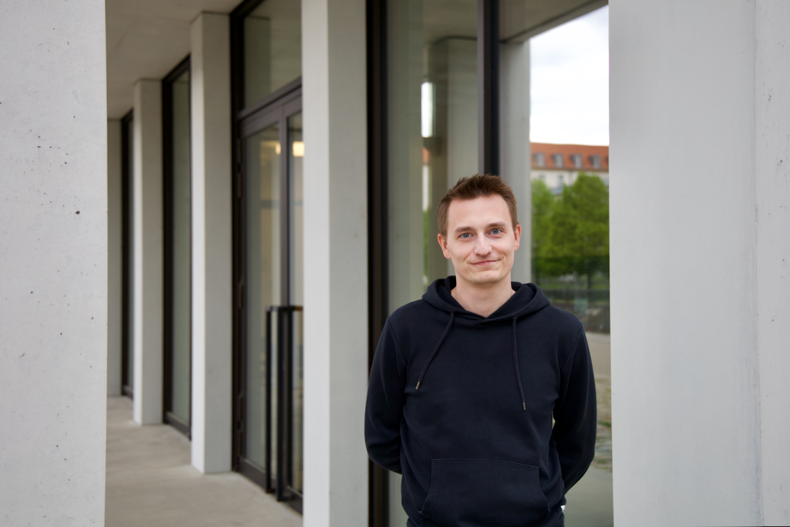

```sh
denis@rdner.de:~ % whoami
Denis Rechkunov
```


I'm a principal software engineer based in Germany with more than a decade of experience, ranging from binary protocols and communication with devices to high-scale front-end apps and back-end services. Although I worked on user interfaces in the past, I found my passion in building complex distributed systems.

When I'm not an engineer I [🏊‍♂️🚴‍♂️🏃‍♂️](https://connect.garmin.com/modern/profile/ccb91222-2fcb-4ba6-87c6-efe33b58650e), [🏍](/posts/motorcycle/), [🎸](/music), [📷](https://www.icloud.com/sharedalbum/#B0vJ0DiRHGvpwq9)

You can reach me via [denis@rdner.de](mailto:denis@rdner.de) and find my most recent CV [here](/cv.html).

# Open Source

* [Elastic Agent](https://github.com/elastic/elastic-agent) — With Elastic Agent you can collect all forms of data from anywhere with a single unified agent per host. I'm a member of the maintaing team.
* [Beats](https://github.com/elastic/beats) — The lightweight shippers of the Elastic Stack. I'm actively contributing as a member of the maintaining team.
* [Catberry.js](https://catberry.github.io/) — isomorphic framework for building universal front-end apps using components, Flux architecture and [progressive rendering](https://youtu.be/aRaQe9n1lPk). Also, lots of plugins and libraries in the related [GitHub organization](https://github.com/catberry). I started it in 2014, used it at work but currently the project is no longer maintained.

See the full list of my projects on [GitHub](https://github.com/rdner?tab=repositories&type=source)
