I like traveling. Bragging facts: at the moment I've visited 15 countries and 32 places, spent in total 102 days traveling. Since I got my motorbike license, I had 2 trips that went particularly well: [Lanzarote](/posts/motorbike/lanzarote) and this one – Granada in Spain. What's different? This time my wife and I rented a motorbike and went exploring. In fact, it went so well with Lanzarote that in Granada we even took a guided tour from a local company (details later) and started filming our trip on camera (only pictures before). What a beautiful footage's come out! It was totally worth doing.

# Arriving

Everything started very spontaneously in September 2019, I found this tour from [www.motorcycletouringspain.net](https://www.motorcycletouringspain.net/) in Spain. It was relatively inexpensive and included a lift from/to the airport, accommodation and breakfasts. Julia (my wife) didn't mind to join me as a passenger and we booked the whole thing.

We flew to Málaga on September 25th and Ron (the tour company owner and guide) met us at the airport. What a lovely person to talk to. We always found an interesting topic to talk about and he knows the area very well I guess because he has been living there for more than 10 years. After we met another tour member from Ireland — David, we went to the guest house in Vélez de Benaudalla, the trip normally takes around 1h 15m (110 km).

This very first day we didn't do much, just went for a walk in the town and had some local food.

<a href="1.jpg" target="_blank">
<figure>
	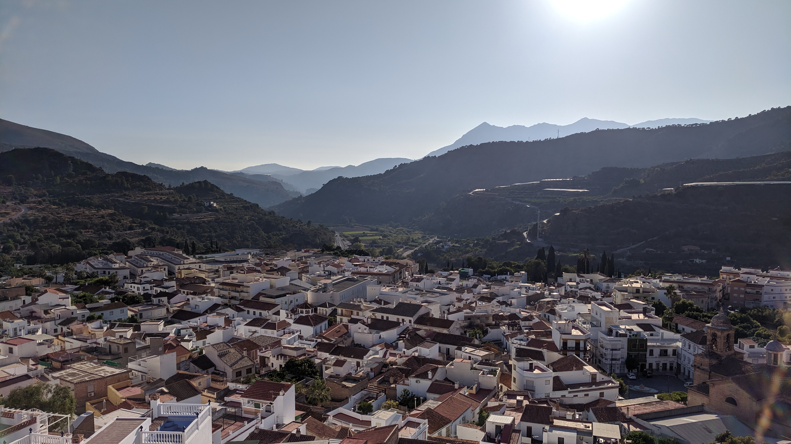
	<figcaption>Vélez de Benaudalla where the guest house was. Click to zoom.</figcaption>
</figure>
</a>

# The first day of the trip

The next day, I got a big BMW GS with a boxer engine (can't remember the exact model and year, but it was quite old) and first we went to the gas station. It was very unusual for me to have a different turn signals layout. The left turn signal was on the left side and the right one was on the right side. Nowadays motorbike manufacturers agreed on having the both turn signal controls in one button on the left. So, it took me some time to adjust.

Then at the gas station I spilled gas all over the bike because the pump pistol was not functioning properly. Normally, it should stop itself when the fuel tank is almost full but this one didn't. Well, nice start, hah? Surprisingly, the smell of gas disappeared quite quickly and we started our trip.

If I'm honest, I was quite nervous because the roads in that area are very twisty and the other 2 riders had decades of riding experience. Also, I was riding with a passenger on a motorcycle which I never rode before. It was quite tough the first half an hour or so, but once I got used to the bike, I managed to keep up and really enjoy the ride.

Make no mistake, if you're not a confident rider and you've never ridden in mountains before it might be too much for you. Ron told me some stories about his clients in the past when they could not continue the trip anymore because of their lack of skill and they had to stop and return to the house. Fortunately, nobody ever died or got seriously injured. I had a couple of close calls, like over-steering once and having oncoming traffic after a blind corner on a very narrow road but nothing serious, I was careful where it was necessary. Once we had a ~270 degree spiral turn which was so weird, you feel like the turn should have stopped like seconds ago but it goes and goes and goes.

Besides the cool twisty roads in the mountains, on that day we went to see an "iron waterfall" (the water is reach of iron, and the rock around it turned orange). The highest altitude we reached that day was ~1,512 m.

A lot of fun these roads, lots of fun. See it for yourself:

<iframe src="https://player.vimeo.com/video/871753579?badge=0&amp;autopause=0&amp;quality_selector=1&amp;progress_bar=1&amp;player_id=0&amp;app_id=58479" frameborder="0" allow="autoplay; fullscreen; picture-in-picture" style="position:absolute;top:0;left:0;width:100%;height:100%;" title="Granada, Spain. Day 1"></iframe>

<a href="route-1.jpg" target="_blank">
<figure>
	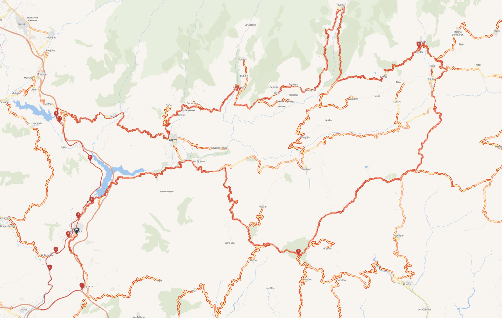
	<figcaption>Our route on the first day of the trip (red line). Click for the full size map.</figcaption>
</figure>
</a>

<a href="2.jpg" target="_blank">
<figure>
	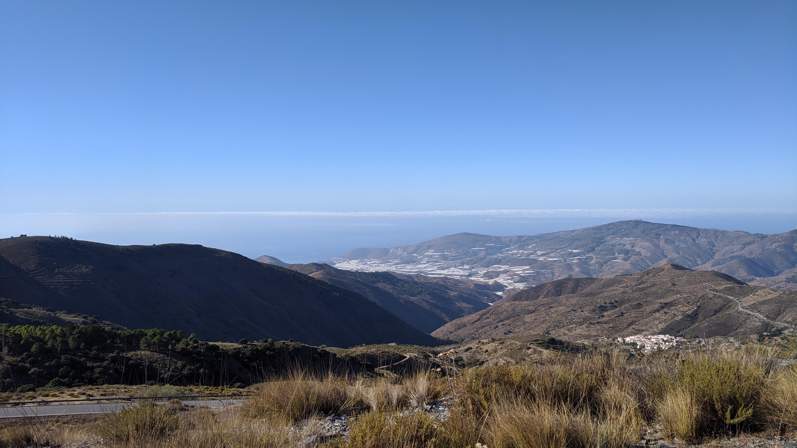
	<figcaption>The first stop. Click to zoom.</figcaption>
</figure>
</a>

<a href="3.jpg" target="_blank">
<figure>
	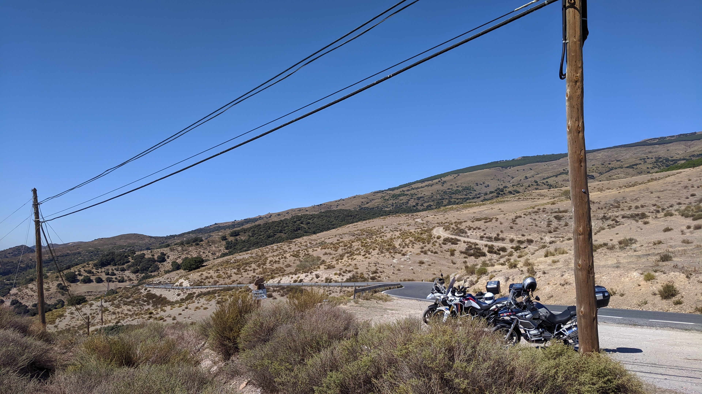
	<figcaption>The second stop. Click to zoom.</figcaption>
</figure>
</a>

<a href="4.jpg" target="_blank">
<figure>
	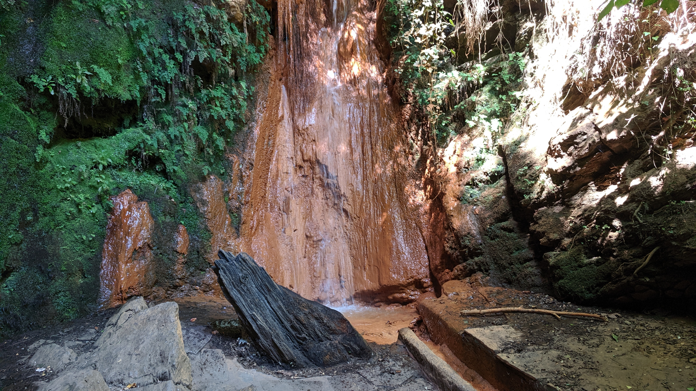
	<figcaption>What I called an "iron waterfall". Click to zoom.</figcaption>
</figure>
</a>

<a href="5.jpg" target="_blank">
<figure>
	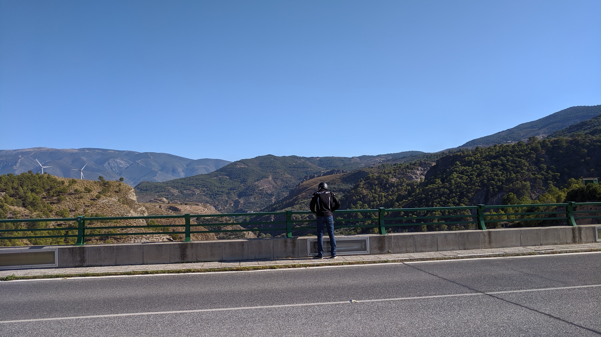
	<figcaption>That's how I filmed the last stop in the first video. Click to zoom.</figcaption>
</figure>
</a>

<a href="6.jpg" target="_blank">
<figure>
	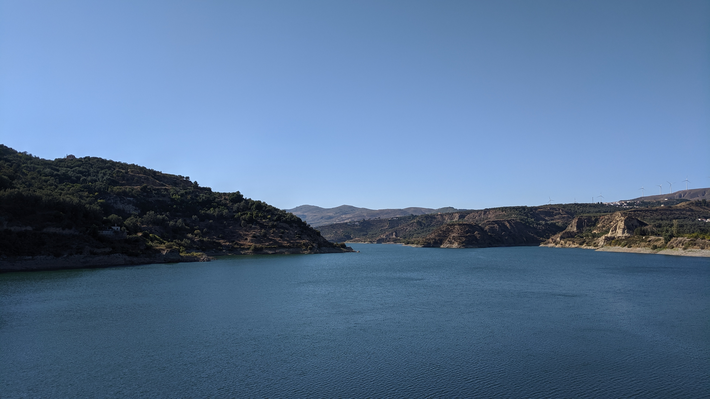
	<figcaption>The view from the other side of the bridge. Click to zoom.</figcaption>
</figure>
</a>

# The second day of the trip

I think, the first day was just a warm up for the second day because the second day felt more intense but also had absolutely fantastic views. Some parts of the route had really narrow roads with a cliff on the side, so it was quite a lot of adrenaline. We went to a beautiful lake and we reached the altitude of ~2,560 m at Monte Ahí de Cara, from where we could see the whole region.

Again, see it for yourself:

<iframe src="https://player.vimeo.com/video/871757513?badge=0&amp;autopause=0&amp;quality_selector=1&amp;progress_bar=1&amp;player_id=0&amp;app_id=58479" frameborder="0" allow="autoplay; fullscreen; picture-in-picture" style="position:absolute;top:0;left:0;width:100%;height:100%;" title="Granada, Spain. Day 2"></iframe>

<a href="route-2.jpg" target="_blank">
<figure>
	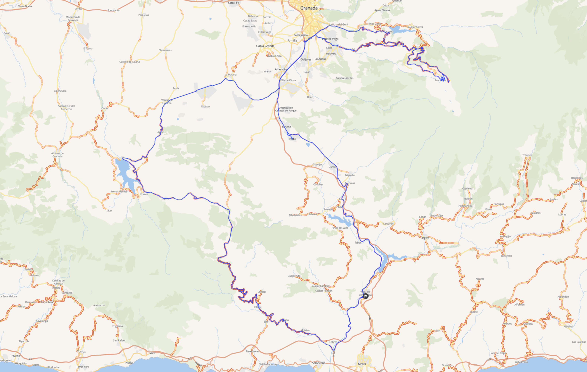
	<figcaption>Our route on the second day of the trip (blue line). Click for the full size map.</figcaption>
</figure>
</a>

<a href="7.jpg" target="_blank">
<figure>
	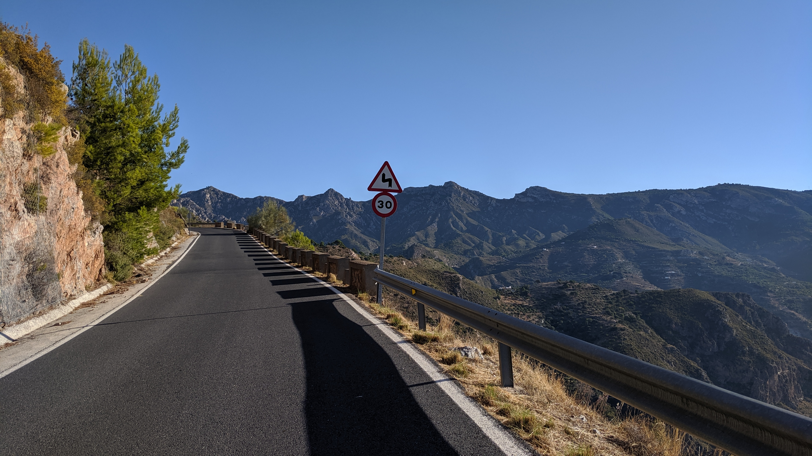
	<figcaption>Somewhere in mountains, these roads are narrow. Click to zoom.</figcaption>
</figure>
</a>

<a href="8.jpg" target="_blank">
<figure>
	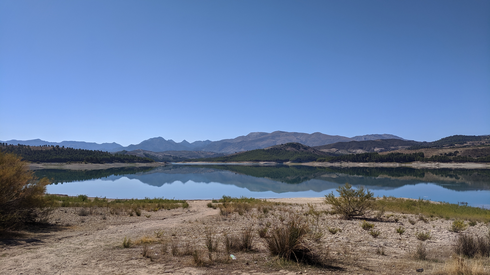
	<figcaption>The view of the lake. Click to zoom.</figcaption>
</figure>
</a>

<a href="9.jpg" target="_blank">
<figure>
	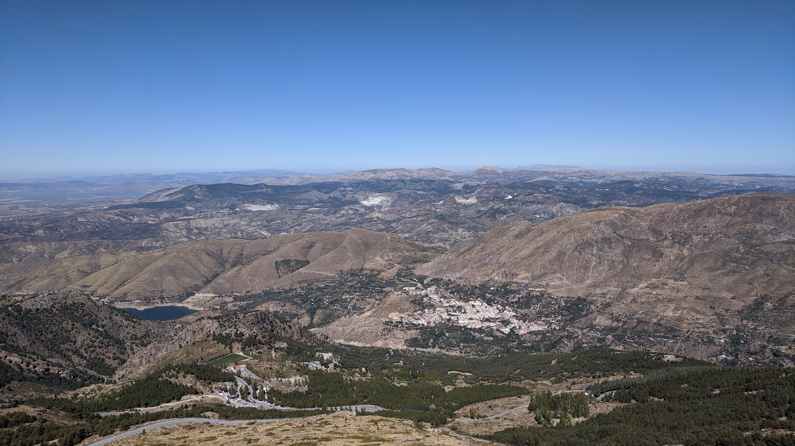
	<figcaption>Mirador Monte Ahí de Cara. Click to zoom.</figcaption>
</figure>
</a>

# To conclude

The trip exceeded our expectations, everything worked out quite well and I enjoyed every single second of it. I even consider to come back some day and maybe take some other tracks in Granada, I'm pretty sure we have not seen all of it just yet. It's also a quite attractive idea to come and live there. The real estate is not that expensive, you can enjoy the view and the roads any time on a motorbike, people seemed friendly and the food was great.

The last hours before our flight back to Berlin we asked Ron to bring us to the beach which is not too far. There was no sand there just little rocks, so it's not completely pleasant to walk with bare feet there but well, it's a beach can't be bad, ever.

<a href="10.jpg" target="_blank">
<figure>
	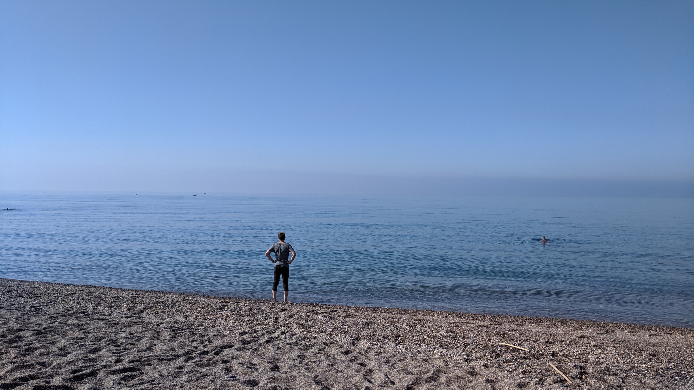
	<figcaption>The beach. Click to zoom.</figcaption>
</figure>
</a>

