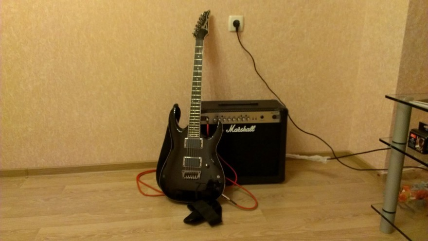
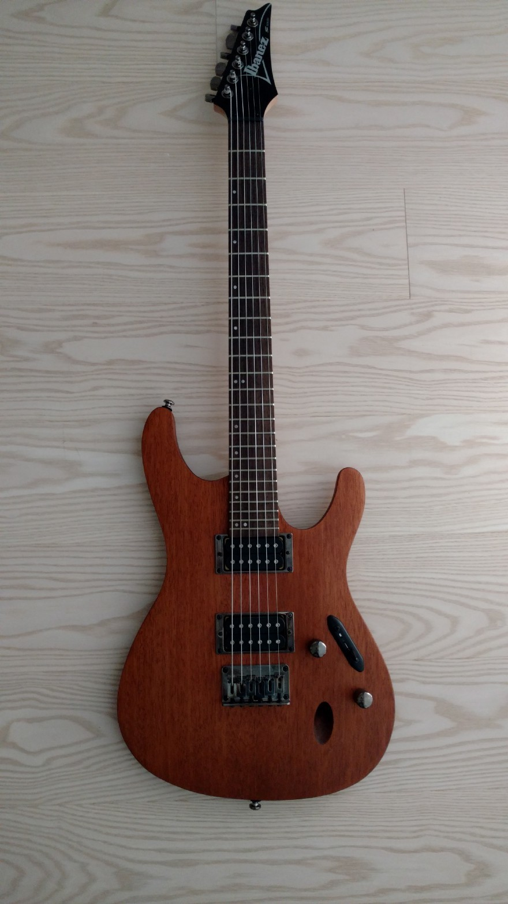
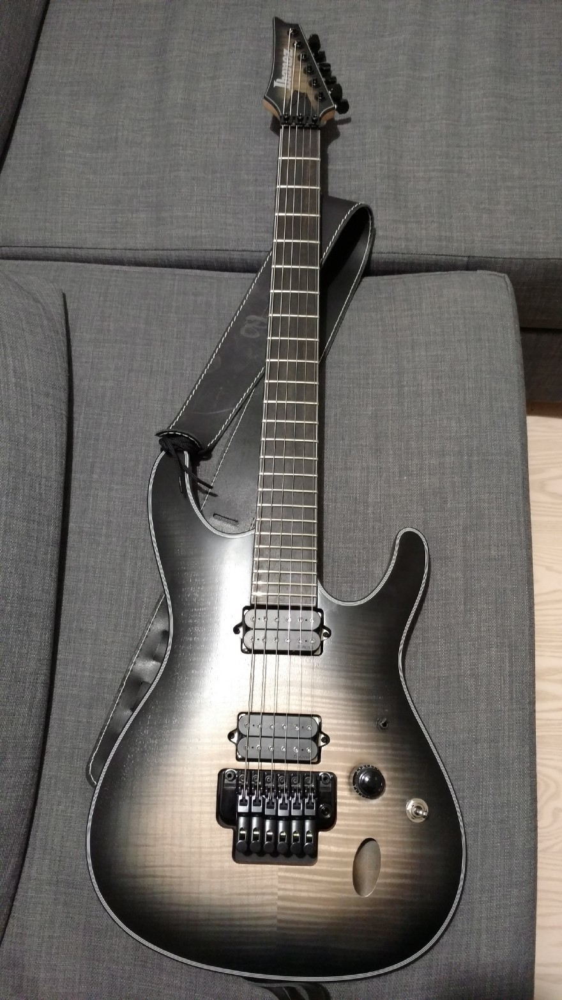
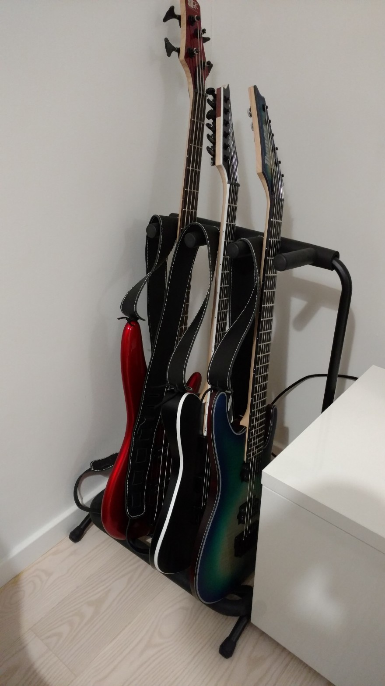

# Disclaimer

A guitar or its sound is a very subjective topic, I don’t claim that I know the best about guitars and any related gear, everything is written here is my personal opinion according to my preferences and experience (which I don’t have much, for sure).

# How it started

Can’t remember exactly, when my parents bought me my first guitar but I have this picture from May 20th, 2005 where I play my first guitar ever.

")

I just turned 16 here but had been having this guitar for about a year already, even bought a pickup (sensor) for it to record and apply effects. So, it was very low price range acoustic guitar but at that point I was not sure if I wanted to start learning how to play guitar, it was just a probe.

# First e-guitar

After some learnt tabs of popular songs I decided for myself that I liked electric guitar much more and asked parents to buy me one for my birthday. But turned out that an electric guitar is much more expensive and needs some additional gear, like amplifier, we could not spend much money on it and bought some of those Gio Ibanez Jumpstart sets that had an e-guitar, gigbag, tuner, strap and amplifier included. I have this awkward picture of me playing a metal riff using this guitar when we were trying to write a song with my friend we had created a band with.

")

To be honest, the guitar was awful, it had a lot of background noise — the only possible option to play was using a noise gate, not aligned frets which caused a lot of buzzing with a low action height, I did my best to adjust everything but it was not enough: either you had no buzzing and 5–7 mm action height or you had buzzing and a playable instrument. The amplifier stopped working after a year. This guitar is still somewhere at my mom’s balcony, dead after my experiments with electronics and adjustments.

On the picture you can also notice that I used very large gauge strings because we played in dropped B, or even sometimes dropped A because, you know, KoЯn did at that time and it was one of our inspirations. But the KoЯn band had 7-string guitars for such low tunings. So, what I did, I just bought a 7-string set and put it on my 6-string guitar shifting the strings (7th as 6th, 6th as 5th, etc). So, I lost the higher octave but was doing pretty well in playing rhythm guitar.

Another picture of me playing with a band in a studio, sorry for the quality, we didn’t have a good camera in our phones at that time.

")

We were renting the place with the equipment which included a Vox amplifier with a built-in noise gate which I liked very much and it was the only thing that made my guitar sound better than usual.

# Break

When I turned 18, I started studying at university and didn’t have enough time to practice in playing guitar. Also, all my experience with the band ended as well for the same reason. I stopped playing at all and also broke my guitar with my mad experiments, nobody wanted to pay for repairing the guitar or buying a new one, I was not making any money at that time.

# Second attempt

After graduating from university I decided to try again and bought a new guitar with an amplifier. I had been working for a year at that point and could afford a better instrument than I had before but still was not sure if I could play again. So, I bought some Ibanez with active pickups and a solid state Marshal amp which had a reasonable price. Unfortunately, I can’t remember the exact model names (especially for Ibanez guitar, it’s almost impossible) but I have a picture:

After the previous “jumpstart” model this guitar was wonderful but it turned out that I lost all my skills after 6 years of studying at university. Well, my playing was not going well, I was demotivated and burnt out. Also, my wife and I decided to move to another city in 2013 and I sold the guitar and amplifier because didn’t want to bring them there. I thought everything was over at that point.

# New inspiration

In December 2015 we moved to Berlin, Germany and here instruments are much more affordable (in comparison with my past salaries) and I met a friend who also played guitar and inspired me for another attempt.

Just after moving I bought [Ibanez S521](http://www.ibanez.com/products/eg_detail.php?data_id=354&color=CL02&area_id=3&year=2016&cat_id=1&series_id=4) and I still love this instrument even though I sold it but not because it was not good (read further).

It was my first experience with S-series by Ibanez and I was amazed how light it was and what a great tone it produced with its mahogany body. The neck was perfect for me, all the frets were perfectly aligned, I used a very low action with large gauge strings (D’Addario NYXL1156) and had the sound I always wanted. Didn’t buy an amplifier this time because it would not be practical for playing at home, especially in Germany, people used to being quite in here (which I very like, by the way). So, as my friend suggested, I bought the [Zoom G3](https://www.zoom.co.jp/products/guitar/g3-guitar-effects-amp-simulator-pedal) processor which is a great device for its money and size (currently I use [BOSS GT-100](https://www.boss.info/us/products/gt-100/), which is huge but very powerful).

I started practicing again, playing in headphones this time. It was very painful, literally, because my fingers were very soft and I installed large gauge strings by old habit but it went away in couple of months.

So, I’d suggest to use 9–42 or 10–46 strings for first several months if you start playing again after a break, even if you used to have large gauge strings in the past.

# Now, I’m sure! Level up? Buying Gibson SG

After some practicing I was finally sure that I wanted to continue playing guitar and improve my skills. I thought maybe it’s time to buy something more expensive and professional then and I ordered Gibson SG Standard HC 2015. Because, you know, it’s Gibson, everybody know that a Gibson guitar is a great guitar. That was a lesson for me.

After playing a lot of different low price range guitars and owning 3 Ibanez guitars even the worst possible “jumpstart” model I was very disappointed in a guitar that costed me 1,000 €.

I think it would make sense to list more details:

* Gibson SG is a very bad balanced guitar in terms of body and neck weight, I saw such feedback before online but didn’t think it would be that bad. So, every time you stop holding the guitar with your hands it just falls in the neck direction
* The strap button is situated on the back side of the body just behind the neck, according to the weight of the guitar it really hurts to play standing after a while even using a 6cm wide guitar strap made of leather (the strap scratches my neck). But that could be my personal issue, of course
* The previous one takes me to another problem — its weight. I know that the famous Gibson tone exists because of the volume of the wood they put in bodies but I thought SG was kind of a slim model for Gibson, like S-series for Ibanez
* Pickups — it had “57 Classic” pickups which, as I found out later, are supposed to give you a very vintage sound. But it had so much background noise and when you touch the back plastic panel on the body it makes weird loud click sounds
* G-Force tuner — to be honest I had concerns about this device even before buying the guitar and even wanted to buy 2016 version because it did not have it but gave it a shot. This tuner constantly tuned almost a half a step higher on factory strings and even doing that it was not accurate. I’ve read the manual, found calibration, other possible options like adjusting a 440Hz pitch but it was still working very bad for me
* Adjustments — out of the box the guitar had a very good action height but the intonation was not good, especially for the low E string. And then it turned out that I could not setup it properly at all because the span of adjustment, this guitar gives you on the bridge, is not enough to get the E note on the 12th fret on the low E string. I had never had this problem before with any guitar.
But to be fair, even after all these problems I had, it was also something good about this guitar. The neck was very comfortable for rhythm playing, the hard case you’d have coming with this guitar is very good and strong, all the hardware is very high quality and it looks very good. Sounds good as well if we consider that the background noise is not a problem and you don’t use a high gain amplifier or distortion. Well, I had to return it back.

The lesson I learnt from the purchase — never listen to anyone about guitars, you must go and play first and only then decide for yourself. I didn’t try it at a store first, I was sure that a Gibson guitar must be great. Everyone have personal preferences which could be different, far different from what considered to be a perfect guitar by others.

# Breaking bad, testing new guitars
I really liked the return procedure of the online store I bought from and I decided “Why would not just buy and try any other guitar if I can easily return it?”. I started looking at guitars that local store didn’t have and I could not come and try. Basically, I was picking new guitars just because of their look and specs on the official web-site, sometimes watching video on YouTube.

My next guitar was Ibanez [RG921WZC-NTF Premium](http://www.ibanez.com/products/eg_detail.php?year=2016&area_id=6&cat_id=1&series_id=1&data_id=321&color=CL01) which, as it’s written in the model name, is a Premium range Ibanez guitar. It had a hardish case with it, looked very great because of the natural finish which I really liked but it didn’t sound as I expected. The guitar had very deep bass sound, too much lows (maybe it’s because of the sensors or wood, I don’t know). And the critical thing for me was a problem with the fretboard, something made strings buzzing even on a relatively high action. For me this instrument was not playable enough. Returned.

Next was Ibanez [SIX6DFM-DCB Iron Label](http://www.ibanez.com/products/u_eg_detail.php?year=2016&cat_id=1&series_id=4&data_id=419&color=CL01).

I had some positive experience with S-series before, also played some Iron Label guitars at the local store. So, it was reasonable choice for me. There are two models: [SIX6DFM](http://www.ibanez.com/products/u_eg_detail.php?year=2016&cat_id=1&series_id=4&data_id=419&color=CL01) and [SIX6FDFM](http://www.ibanez.com/products/u_eg_detail.php?year=2016&cat_id=1&series_id=4&data_id=420&color=CL01) (additional “F” letter). The only difference they have is the bridge: the first has a floyd-like floating tremolo system from Ibanez and the second has a fixed one. I had never had any experience with floating tremolo systems when decided to try this guitar. I thought “why not?”.

After 3 days of adjusting the tremolo, even after I watched some tutorials about locking tremolo first and then adjusting spring tension after it’s in tune, I understood that it was not my thing at all. I just wanted to have a ready guitar after spending 15 minutes on re-stringing it. The final reason was — new strings, I installed a large gauge strings again and it turned out that the spring tension the guitar had was not enough to compensate the strings. Well, I didn’t want to buy additional springs and to spend more time on this.

But I must say the only thing about this guitar I didn’t like was the floating tremolo system (not this particular one, just in general). The rest of it was totally perfect for me. I returned it but ordered the version with the fixed bridge instead.

After the floating tremolo experience I decided that I was not ready for it. And [SIX6FDFM](http://www.ibanez.com/products/u_eg_detail.php?year=2016&cat_id=1&series_id=4&data_id=420&color=CL01), I’ve got next, was a perfect guitar for me. I still enjoy playing it and didn’t find any problem with it at all. Awesome neck and fretboard, awesome-sounding passive DiMarzio pickups, locking tuners and no tone knob. It has much better sound than S521 I had before, has all its advantages and looks just gorgeous.

At that point I had 2 S-series guitars from Ibanez which didn’t make much sense to me, especially when the new S-guitar was that great. So I just sold S521 to a colleague and had a free slot to fill in my guitar stand.

I decided to look what else Ibanez has and even thought of buying a 7-string guitar but then I found this great [FRIX6FEAH-CSF](http://www.ibanez.com/products/eg_detail.php?year=2016&area_id=2&cat_id=1&series_id=6&data_id=432&color=CL01) telecaster shape metal guitar with active EMG pickups. It sounds great, I had never tried EMG pickups before I tried this guitar. The idea of changing batteries was always a concern to me. But, you know what, it’s worth it. The biggest difference I noticed is how harmonics sound in distortion using these pickups and of course the amount of output you have from the pickups and less noise.

Despite the body is bigger than S-series guitars have, it’s still not heavy. Locking tuners, no tone knob, kill switch (which I find useless, anyway) — everything that makes it an Iron Label guitar is great. I liked it and kept as a second guitar with a different tone for recordings.

Also, this time I switched to a different gauge of strings for both guitars. I installed the D’Addario NYXL1154 set that has more balanced tension than 11–56, I had before, which is better for a neck, I assume, but also sounds at the same badass level.

# Found perfect guitars, is that over?

No, it’s not. I will definitely keep [SIX6FDFM](http://www.ibanez.com/products/u_eg_detail.php?year=2016&cat_id=1&series_id=4&data_id=420&color=CL01) and [FRIX6FEAH-CSF](http://www.ibanez.com/products/eg_detail.php?year=2016&area_id=2&cat_id=1&series_id=6&data_id=432&color=CL01), they are perfect for me but recently I started looking at [.strandberg\*](https://strandbergguitars.eu/) guitars mostly because of [Sarah Longfield](https://www.youtube.com/watch?v=ztHILrfiRhQ) videos and got very curious to try such instrument. It’s completely different from what I’ve held in my hands before. Unfortunately, I could not find any .strandberg* guitar in Berlin and I could not try it. The official online store is out of stock for [Boden OS 6](https://strandbergguitars.eu/product/boden-os-6/) model. So, I ordered a purple [Boden OS 7](https://strandbergguitars.eu/product/boden-os-7/) model, which would allow me to try a 7-string guitar at the same time. I’m currently waiting for the delivery. But this guitar deserves a separate post.

# Conclusion
Some life lessons I had during this time:

* You can start playing again after a big gap if you’re inspired and motivated enough. It’s better when you have a good example or circle of people who do the same around you and motivate you
* You can learn a lot from guitar lessons on YouTube. I wish I had it when I was 16. I would not recommend any particular channel, just find a person you like the most and stick to the channel
* Follow some professional players who has a vlog, like [Rob Chapman](https://www.youtube.com/user/RobChappers) for example, or maybe your favorite band does vlogs. They would show you a lot of information about tours, gear, recordings, problems they solve and just inspire and motivate you very much. It will help you to set your goals, which takes us to the next one…
* Set your goals! Like “I want to play the major scale shape in 120 bpm tempo”, does not matter what exactly but it should be measurable somehow. I need to know that you have some progress, it should be visible
* Choosing a guitar is very-very subjective. Everyone have very different preferences. If you tried a guitar, you’re comfortable playing it and like how it sounds — that’s your instrument. But also be aware that in stores guitars usually don’t have well adjusted bridge and neck, because of that…
* If you can, take a guitar home and try to adjust it as you like (**if you know what you’re doing, otherwise ask a professional**). Because only at home you can adjust the guitar according to your preferences, try your favorite presets/gear and compare the sound of the guitar with another one you already have (possibly). Because sound is an equation with many variables, nobody can judge a guitar by a video on YouTube or playing it only once using the only amplifier in a store (or even without it at all). At least, I personally think it’s not a proper way to do that and I’m really glad I had a chance to try those guitars at home.

I don’t consider myself a good guitar player, but I have enough motivation now to proceed with the education and practice to make my skills better and who knows what happens next. I’ll be in touch.
