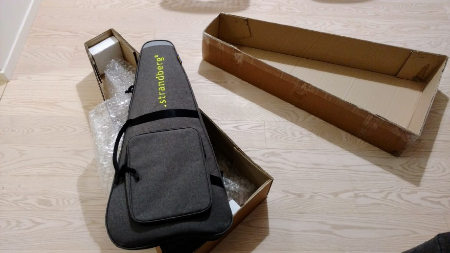
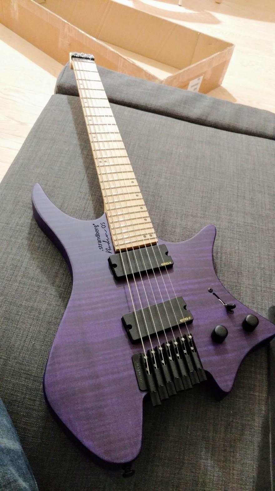
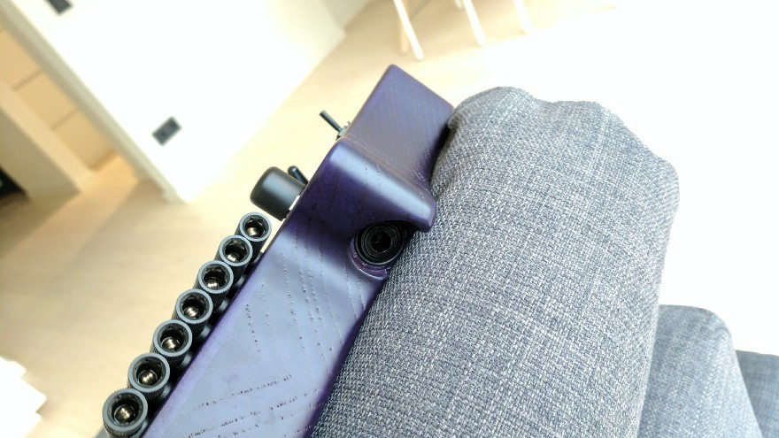
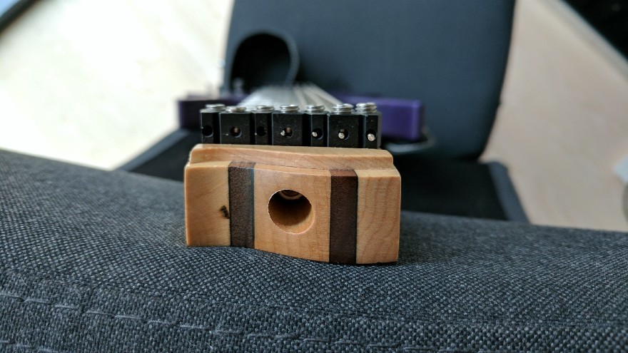
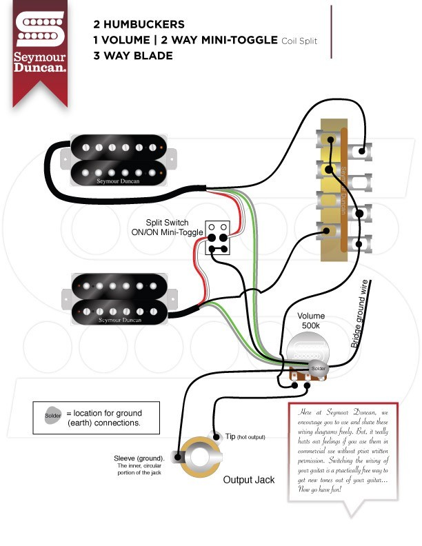
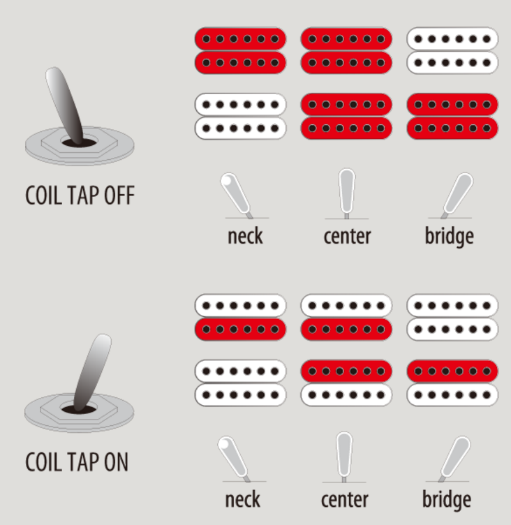
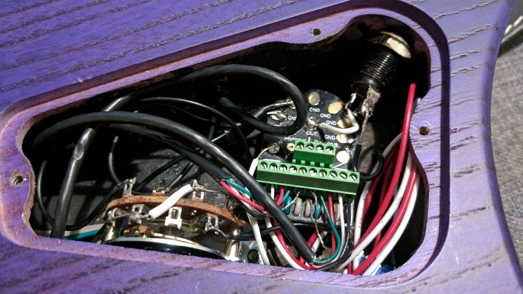
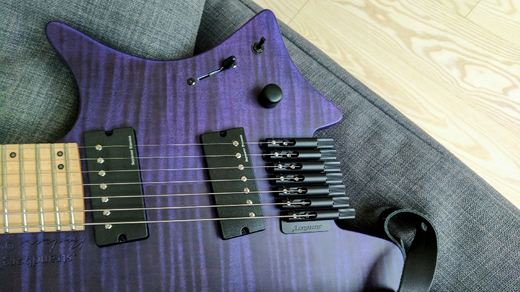

Hey, everyone! In [my previous](../chasing-perfect-guitar) post I promised to write about the [.strandberg\*](https://strandbergguitars.com/) guitar I had ordered because it definitely deserved a separate post. Well, here we go! I’m going to share all my thoughts on .strandberg* Boden OS7, all the up/down sides I found and how I fixed what I didn’t like and eventually got a perfect guitar for myself.

A short disclaimer: this post is my personal opinion and nobody paid me for this.

# First introduction

I can’t remember when I saw a .strandberg* guitar for the first time but I definitely do remember where. Have you heard of Sarah Longfield? If not, check her [YouTube channel](https://www.youtube.com/user/MissSmiles4u) out, she is an awesome musician and she plays an 8-string custom-made .strandberg* guitar which looks fantastic. I was truly amazed by the body shape, bridge system and of course the headless neck which looked very unique and weird to me at that time.

But the final decision to order the guitar, I made when I watched [this video](https://www.youtube.com/watch?v=_rzEusAuL80) where Sarah told more about her guitar and about the neck shape in particular. The neck shape is called “The EndurNeck”, you can read more about it [here](https://strandbergguitars.com/strandberg-endurneck/). Basically, it’s a trapezoid shape that leads your thumb all the way up/down through the frets and turns out to be very ergonomic and comfortable. I got incredibly curious about this guitar, went to .strandberg* website for the first time and decided to order Boden OS7 (the cheapest production version, even picked one under a discount).

# Getting started with .strandberg*

I ordered my guitar from the European website on December the 9th. This website delivers to Germany (the company itself is based in Sweden). At that point they were pretty much out of stock for 6-string production guitars, they had the only one in black color which is in my opinion too boring.

I took a look at 7-string guitars and found a purple Boden OS7 with an almost 400 euro discount. Purple is my favorite color and I always wanted to try 7-string, well, the choice was obvious to me. I got the guitar from Sweden in 7 days on December 16th.

You would find a very high quality gig bag inside the box and the guitar itself inside the bag. Also, some hex keys and a factory checklist with a signature of the person responsible for quality of your guitar.

If I got it right, it had a company-branded string set installed but I personally didn’t like it and installed D’Addario [NYXL1164](https://www.amazon.de/gp/product/B00YJJ0K0I) which turned out to be too large gauge and later I switched to 1059 and [Ernie Ball 2620 11–58](https://www.amazon.de/gp/product/B0002PBS8G) (despite the purple wrap color I chose them for their sound) later which turned out a perfect fit for this particular guitar.

# What I liked

## Body

The body shape is perfect for me. It’s convenient to play in any position you can imagine. The output jack is situated in a very convenient place (image below) and I don’t even notice the cable presence when it’s plugged in.

The body is extremely light-weight, I think, it’s even lighter than my Ibanez S-series guitar.

The knobs are made of ebony which saves some weight (if you compare to metal ones) as well and feels pretty good.

## Bridge
The system is brilliant, you just turn the knobs for each string and adjust the pitch or you turn it all the way up and pull off the string and replace it with another one. There is a cool [tutorial video](https://www.youtube.com/watch?v=Hij9LFw4jw4) from the manufacturer where the person explains how to restring the guitar, adjust the action and intonation.

I found this system very stable, I mean it keeps being tuned after weeks of playing.

## Neck
Neck is very comfortable to play, it has fanned frets though which can cause troubles when you bend too far but usually I don’t even notice them.

Locking nut is very easy to use, no problem here. Also, the neck has side dots which are illuminated in a dark environment, can be useful for a stage performance, I assume.

Also, a good part is the truss rod, it’s very well-accessible, I mean you don’t have to do anything to access it in comparison to most guitars where you have to lose a couple of strings and/or remove a plastic shield, +1 to the headless design.

# What I didn’t like

## Pickups

When arrived, the guitar had [EMG 707X](http://www.emgpickups.com/707x.html) pickups installed on it. I was very disappointed by the sound they produce. It sounds very artificial, filtered, has short sustain, I did my best to create an appropriate preset on my processor but had no luck, I still didn’t like it after all and comparing with my [Ibanez SIX6FDFM](http://www.ibanez.com/products/u_eg_detail.php?year=2016&cat_id=1&series_id=4&data_id=420&color=CL01) the sound was much worse.

So, I decided to replace the pickups, let’s talk about it further in this post.

## Adjustment process

Not a big deal really because you need to do it only once usually, but it was really inconvenient to adjust intonation and action because of the nature of the bridge system. You have to lose a string first completely, change the intonation/action and then tight it up again. When you’re trying to find a perfect point it can be annoying to repeat this procedure over and over again.

# Changing pickups
As I mentioned before, the sound was disappointing and I decided to get rid of the active EMG pickups. So, after some research I chose Seymour Duncan Nazgul/Sentient pair and this wiring scheme:

Which gives us, basically, these switching options:

I got the same wiring with my Ibanez SIX6FDFM and very liked it. I don’t really understand why manufactures keep putting tone knobs on their guitars and losing a part of the signal in it. All guitars without tone knobs I’ve heard had nicer sound, especially for djent/metal style of music. But again, it’s my personal preference. So, the plan was to replace the tone knob with the coil-split switch.

After a couple of evenings and with my wife’s help we finished wiring the new circuit replacing almost everything. I’ve installed the [Seymour Duncan Liberator](http://www.seymourduncan.com/accessory/liberator-500k) volume knob. It allows you to re-install pickups in the future without soldering at all. That’s what I’ve got as a result:

The new sound amazed me. Turns out the EMG pickups were hiding the true potential of this guitar, the sound is outstanding nothing to compare with what it had before. In fact, this is the best sound I’ve ever heard and it became my favorite instrument after all. Maybe I’m a little biased, of course, but I love it and that’s what important to me.

# Was it worth it?
Definitely, I would say: Can’t find a perfect guitar — build it! For me it worked pretty well as you can see. Don’t be afraid of experiments and maybe it would turn out a best thing you’ve ever done.
