It was a typical weekend of 2018 when I went to see a new movie. As usual, the movie theatre played a few commercials and trailers before the actual movie started. This was one of the played commercials:

<iframe src="https://player.vimeo.com/video/304263309?h=327740ba45&color=5a2673&byline=0&portrait=0" style="position:absolute;top:0;left:0;width:100%;height:100%;" frameborder="0" allow="autoplay; fullscreen; picture-in-picture" allowfullscreen></iframe>

First, you see a woman who is training for a triathlon race and apparently her family, particularly her daughter, does not really understand why she is wasting so much time on it instead of being with her family. But then the story unfolds: we start seeing that this woman was in a tragic accident where she barely survived and lost her leg. Eventually, her daughter understands the "why" and realises how important it is for her mum and how important it is to support her.

I don't think I can express how much this, a less than 5 minutes long video, touched me emotionally. This was the moment in my life when I decided that I could do that too -- finish a full distance triathlon aka IRONMAN.

Back then I was going through a very serious crisis in my life. My mind was in a very dark place and I definitely needed a change. I saw this goal as my remedy. Looking ahead, it turned out to be true.

# Triathlon

This is a sport where you swim, then ride a bike, then run. Switching between sports happens in a so-called transition zone. You swim first, exit the water, run to your bike, take it out of the transition zone, ride a loop (or several loops), return to the transition zone, change to your running gear, exit the transition zone, run a loop (or multiple) and finish somewhere near the transition zone.

Different races might have different layouts but the one described above is very common.

There are different distances or race formats like in running, among all of them the most common are:

Name | Swim | Bike | Run
-----|------|------|----
Super Sprint | 400 m | 10 km | 2.5 km
Sprint | 750 m | 20 km | 5 km
Olympic Distance | 1500 m | 40 km | 10 km
70.3 or Middle Distance | 1900 m | 90 km | 21.1 km
140.6 or Long Distance | 3900 m | 181 km | 42.2 km

You might have heard of 70.3 as "IRONMAN 70.3" (half IRONMAN) and 140.6 as just "IRONMAN" (full).

# Chasing the Goal

Finishing an IRONMAN race was a very ambitious goal and I had a few problems to solve:

* Weight: I was 86 kg (and trust me it was not muscle mass)
* Running: I had never gone for a run/jog
* Cycling: I had never tried to ride a road bike before
* Swimming: I could not swim and always panicked in the water

## Weight

<a href="2018_appearance.jpg" target="_blank">
<figure>
	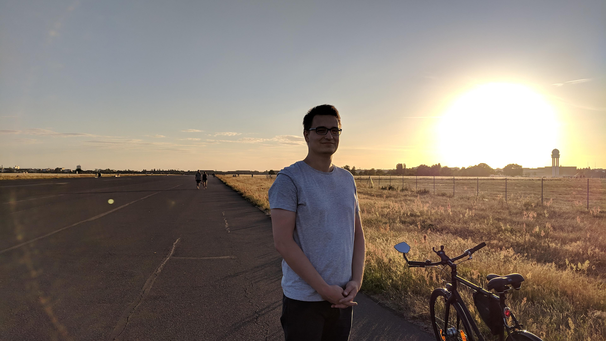
	<figcaption>This is how I looked like in July 2018</figcaption>
</figure>
</a>

Actually, I didn't think I was overweight back then until a few friends and family members commented on my appearance. I didn't take it seriously, but when I tried to go for my first run in winter of 2018 it went horribly. I felt very heavy, like half of my body was bouncing on each stride. My ribs hurt after this run just because of all this bouncing. This is how I set my first goal -- first I need to lose weight.

In January 2019 I put myself on a diet gradually increasing my calorie deficit over time. I found some calculators online where I got the number of calories I needed to consume every day. Back then I was using a Fitbit fitness tracker and it had a very nice app where I could count calories of every meal I had. Additionally to that, I started walking a lot and worked out at a gym.

It took me about 2 months to lose 10 kg and to get down to 76 kg. Then I adjusted my diet and it was not so aggressive anymore. It was all just counting calories and maintaining an active lifestyle -- it did the trick. Honestly, I didn't expect this to go so well but of course it required lots of will power and commitment. Some people told me that I would bounce back to my previous weight very quickly but to their disappointment it's 2023 and I'm 73 kg. So, I guess it does not always happen.

## Running

After I got rid of those 10 kg, running became a breeze. I found a simple training plan and set myself a goal to run a [Berlin City Night 10K race](https://www.berlin-citynight.de) in August 2019. I don't remember if I skipped a single workout and it worked! I finished my very first 10K race with a time of 0:49:02.

<a href="2019_10k.jpg" target="_blank">
<figure>
	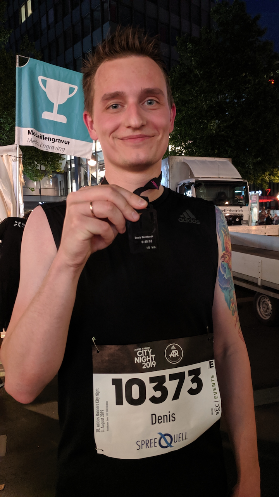
	<figcaption>August 2019. Berlin City Night 10K</figcaption>
</figure>
</a>

I liked running. Especially after a long day at work it was mentally relaxing, almost meditative. I had time to think about a lot of things, to plan my nearest future and when my workout duration increased to multiple hours, I started listening to audiobooks which completely changed my experience.

If you want to read more about my running, please see [my previous post](/posts/sport/why-run/).

## Cycling

My entire life I enjoyed cycling, it was not new to me. However, road bikes, let alone TT bikes with their aerobars, were something I had never had experience with. I had just a simple commuter bike that I took to the office. I didn't know anything about cycling training metrics like power, cadence, etc. So, I subscribed to the [GCN Youtube channel](https://www.youtube.com/@gcn) and started researching the subject.

I replaced my bike with another lighter but still upright bike and I started experimenting with my bike fitness trying to find my current limits.

In May 2020 I went for a [170 km bike ride](https://connect.garmin.com/modern/activity/4901125161) around Berlin and it didn't feel that bad. Of course, I made some rookie mistakes with fueling and hydration but I got back home alright. I also did a few other ~70-95 km long rides around that time.

Later, in September 2020, I joined my friends for [another ~170 km ride](https://connect.garmin.com/modern/activity/5526460704) to follow the [Mauerweg course](https://www.berlin.de/mauer/mauerweg/) and it was a lot of fun. Given we didn't care about the time, it was very relaxed and I really enjoyed the trip.

<a href="2020_Mauerweg.jpg" target="_blank">
<figure>
	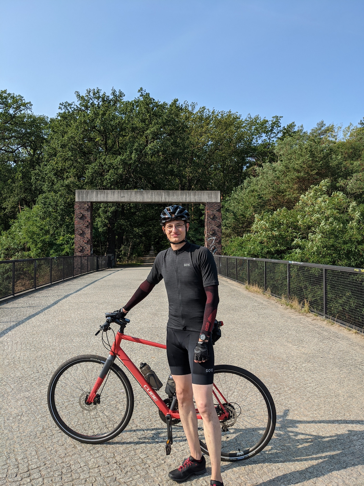
	<figcaption>September 2020. Mauerweg 170k</figcaption>
</figure>
</a>

After these rides I gained some confidence in my cycling. It was no longer a question if I needed it in my life, and in the same month I bought my first road bike -- Canyon Endurace CF SL Disc 8.0.

<a href="2020_Canyon_Endurace.jpg" target="_blank">
<figure>
	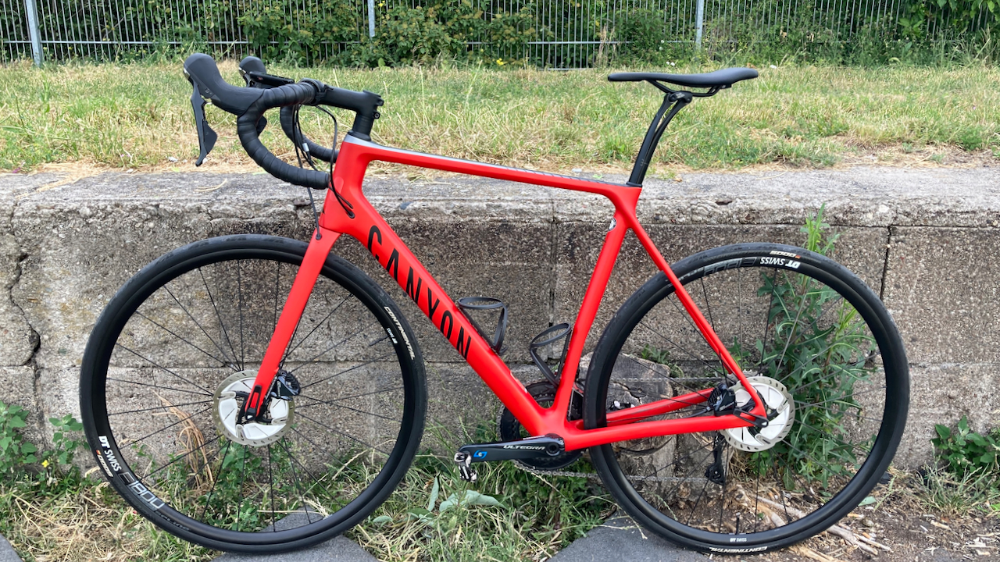
	<figcaption>First Road Bike. Canyon Endurace CF SL Disc 8.0</figcaption>
</figure>
</a>

I also purchased an indoor trainer and started training on [Zwift](https://www.zwift.com/eu/athlete/170b2559-f53e-43a7-8968-ea335dd845ee). Even joined and graduated from their Zwift Academy in 2020.

So, this one was also sorted.

## Swimming

Swimming was a real struggle for me. Every time I tried to think about going to a swimming pool and just trying to learn how to swim on my own, it made my heart pound. It was clear that I needed some help.

I live in Berlin, we do have swimming classes here but everything I could find was in German and my German was not perfect. Additionally, this was going to be a very stressful experience for me, adding speaking German to the mix scared me even more.

So, I did what every normal person would do -- I procrastinated. For years. We all know what happened next -- the global pandemic. Every race got cancelled, in person classes stopped, there was almost no chance to start swimming back then. So, I focused on my running instead.

Only in October 2022 I got back to this topic and started actively looking for a swimming coach. This is when I found [Stefan](https://helwig.berlin) who is also a passionate triathlete himself and has a lot of experience with teaching people how to swim.

I'm going to be honest, after a few first sessions we had together I was sceptical: I could not believe that I would ever be able to swim even 400m, not mentioning the 3900m of the full IRONMAN distance.

Only after some time did I learn that swimming improvements are not linear. I occasionally had these "clicked" moments that moved me forward: suddenly it felt easier to swim or my swimming suddenly got faster. It always followed some change in my sensations while swimming. Usually, it was happening because of some minor changes in my posture, catch, pull or recovery. Most of the time it happened during long "boring" swims.

I started gaining a lot of confidence and on the 1st of January 2023 (yes, I went to the pool voluntarily) I suddenly swam more than 2300m non-stop with a pace of 2:30min/100m. It's not fast but for the first time ever I didn't need to stop, it felt like I could swim forever with this pace. Incredible.

The challenge with swimming is that although you can learn the whole theory of the perfect stroke, you can overcome your fear of water, you can learn how to breathe during the front crawl but unless you know how the correct stroke **feels**, you are not going to execute it right. Swimming is a very technical sport and every tiny detail matters. You need to map the right movement to your sensations and learn how the right stroke feels.

I've been swimming for the last 10 months and I still have so much to learn in order to reach my dream of 1:40 min/100m. Only last week I found a serious mistake in my arm recovery and suddenly I was able to increase my cadence and my swimming got easier.

Another interesting fact: swimming significantly changed my running. I started to feel new muscles in my abs and core which I had not been able to engage before and it improved my running posture dramatically.

# Triathlon Training

At the same time when I started swimming I switched to full triathlon training. It was very different to what I had been doing previously (like long runs up to 30 km, maybe a couple of short interval sessions per week).

Now my training has become more dense and efficient. Normally, it was 2-3 cycling sessions a week, 2 swimming sessions and running the rest of the time. Runs were mostly long interval sessions instead of base-focused slow runs. Also bricks -- type of workout when you run right after a long bike workout.

I modified my Canyon bike to be more suitable for triathlon: I put aerobar extensions on the drop bars, replaced the stem with a shorter one and replaced the seatpost to reduce the reach for the aero position. I was still unsure about this whole triathlon thing and didn't want to invest in a Tri/TT bike just yet.

I must admit, this was more fun than just running. Doing one sport may become boring at some point but having such a wide variety of workouts kept it interesting.

Obviously, without any triathlon racing experience and barely swimming I could not set the full IRONMAN race as my first goal. So, Stefan and I planned 2 triathlon races for 2023:

* [Werbellinsee Triathlon](https://werbellinseetriathlon.de) as my very first triathlon race where I gain my very first experience and test myself before the main race of 2023
* [IRONMAN 70.3 Erkner](https://www.ironman.com/im703-erkner) as my main goal this year which would give the taste of IRONMAN events.

The rest of my year remained full of running races which I also trained for. One of them was an ultramarathon in the Austrian Alps. ~92 km with ~4000m of elevation gain. I had signed up before I started my triathlon training but I still was very curious about this type of race.

Thankfully, running also benefits triathlon 🙂. Very convenient.

# My Very First Triathlon Race

[The Werbellinsee Triathlon](https://werbellinseetriathlon.de) takes place not that far from Berlin but it's far enough to spend a night there to stay on the comfortable side.

The race I signed up for was their olympic distance:

* 1500 m swim: 2 loops of 750 m with exiting the water (aka Australian exit)
* 38 km bike: 2 loops of 19 km with 170m of elevation gain each
* 10 km run: 2 loops of 5 km with 50m elevation gain each. I know, it does not sound particularly hilly but all that elevation gain was concentrated in one single hill. To be fair, Stefan warned me in advance but I didn't take it seriously.

It was quite warm on the race day and I chose not to take my wetsuit with me. Only at the start line did I realise that this was a very uncommon choice 😀. My wife Julia came to support me and filmed a few videos of me going through the race which I later edited into this:

<iframe src="https://player.vimeo.com/video/871746737?h=e2e2fbcc27&color=5a2673&byline=0&portrait=0" style="position:absolute;top:0;left:0;width:100%;height:100%;" frameborder="0" allow="autoplay; fullscreen; picture-in-picture" allowfullscreen></iframe>

I was very slow out of the water but that was expected, taking into account that I had been swimming for less than a year at that point. Also, due to my lack of confidence in open water I started at the back of the crowd and it was not a rolling start, so I probably lost a lot of time just by doing that.

The cycling course was also noticeably hilly and I was surprised to see that most of the people didn't take advantage of the downhills on the bike. They just stopped pedalling and kept coasting. I was overtaking lots of people, especially downhill.

The run was tough, not going to lie. That hill! I walked it twice. My legs didn't work that well after the bike leg, especially quads. And guess what muscles you need for running uphill and downhill? Correct, quads! I had done a few brick sessions before I did this race but my legs never felt that numb before.

All in all, it was a great experience. And I was very inspired to continue doing triathlon races afterwards. As you can see on the video, I was smiling all the way through the race which is not common for me according to photographs taken during running races 😀.

# IRONMAN 70.3

Things got real. It's not a small village race anymore. The organisation scale was noticeably different, rules stricter.

## Planning

I think people don't realise how much planning a race of this kind requires from you, you need to:

* Register and pick up you start package
* Pack your transition bags
* Plan/imagine your transition routine
* Plan your nutrition and hydration
* Technically prepare your bike
* Check your bike in a night before the race
* Do final preparations in the race morning
* Finally, put your wetsuit on and tremble from nerves at the start line.

<a href="2023_IM_Bike_Bag.jpg" target="_blank">
<figure>
	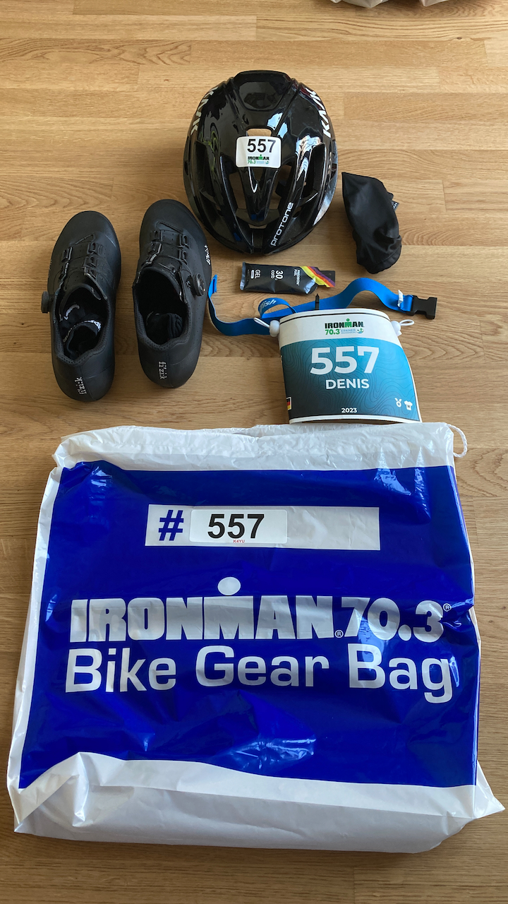
	<figcaption>Bike Bag</figcaption>
</figure>
</a>

<a href="2023_IM_Run_Bag.jpg" target="_blank">
<figure>
	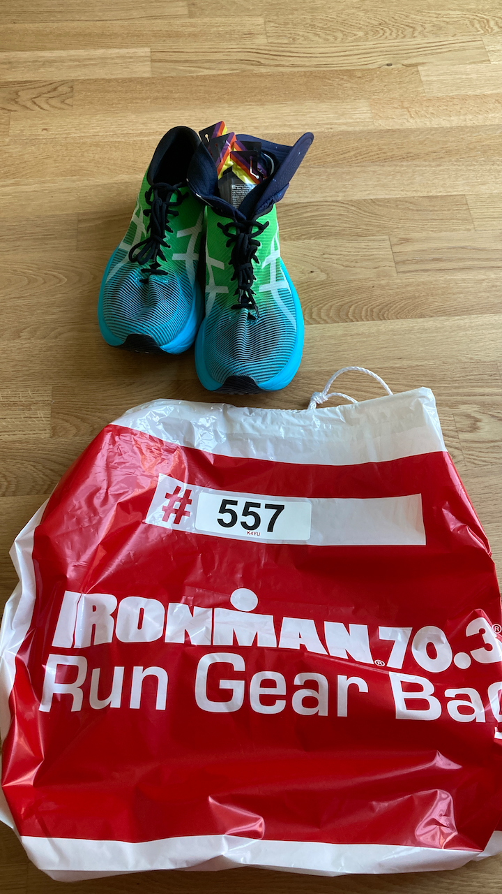
	<figcaption>Run Bag</figcaption>
</figure>
</a>

Also, imagine all the logistics around it. Although Erkner is near Berlin, it's still a train from the station which is 2 km away from the place where I live. The bags are large and it's very nice to have someone to help you.

In the end I had to go to Erkner three times on three different days:

1. to register and pick up my starting package
2. to hear the briefing, check my bike in, put my transition bags on the hooks
3. to actually race

The wait between the briefing and the bike check-in was more than an hour under the straight sunlight in a very long line.

## Triathlon Bike

A little detour to my story with the new race bike.

After my first triathlon race I understood that the major annoyance and safety concern I had was shifting gears. You see, if you're on a road bike with aerobar extensions you have to change your position every time you shift and particularly on a hilly course it is very sketchy. So, I started looking for a second hand triathlon bike on the local marketplace.

3 weeks before the race I found this very attractive bargain on a Canyon Speedmax and I went forward with buying it. To not waste my purchase, I started rushing to prepare this bike for my IRONMAN 70.3 race.

I had 3 new problems to solve:

1. Bike fitting -- I had no idea what position I needed. I booked a professional bike fitting appointment **1 week before the race**. Which actually went very well and the new aero position worked out very well during the race later.
2. The bike had some disc brake problems: they were rubbing quite a lot despite my best efforts to align the callipers. It looked like the rotors were bent. So, I ordered new rotors, replaced the old ones and the brake pads were still rubbing. Of course I tried to re-sit the pistons and it didn't help, after the first squeeze of the brake levers the problem was back. It was 10 days before the race and I didn't want to mess with the hydraulics, so, desperate I went to a local bike shop and bought new low-quality metallic brake pads. Surprisingly this is what fixed the issue and suddenly I had like twice the clearance between the brake pads and rotors. I still don't know how it worked exactly. Few days after the race I found a special tool from SRAM that helps to properly re-sit the pistons and I was able to put high-quality organic brake pads again without rubbing the rotors. Now it's back to normal. Didn't know that this piece of plastic was so necessary to re-sit the brake pistons. Never had issues with Shimano disc brakes.
3. I bought the bike with some very basic training wheels, so to make the most out of my purchase I had to also buy light aero wheels. I took this opportunity to try a tubeless setup for the first time too.

So, here I am, days before my IM 70.3 race with a new bike, new position, magically fixed brakes and tubeless setup that I have not tried before. This was going to be interesting.

<a href="2023_Canyon_Speedmax.jpg" target="_blank">
<figure>
	
	<figcaption>My Canyon Speedmax CF 8 Disc</figcaption>
</figure>
</a>

## Before the Race Day

I was one of the first people in line for the bike check-in, so the transition zone was almost empty.

<a href="2023_IM_Transition_Zone.jpg" target="_blank">
<figure>
	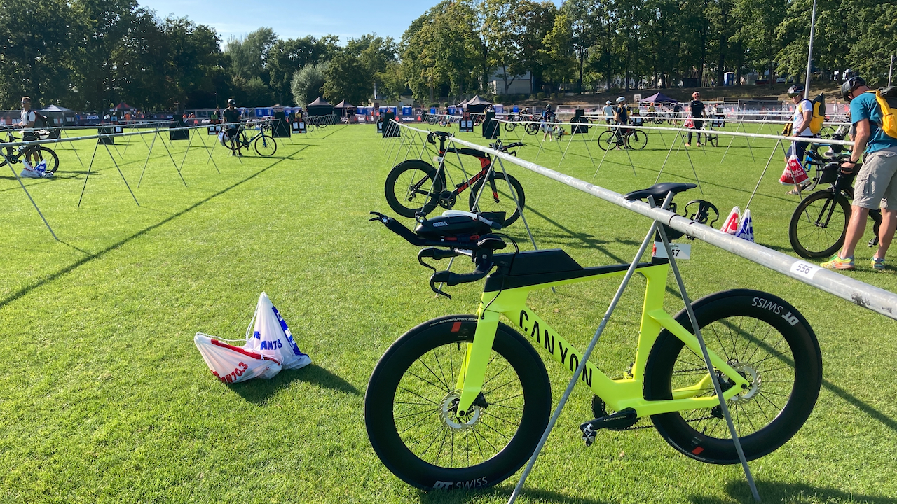
	<figcaption>Transition Zone</figcaption>
</figure>
</a>

I noticed that my saddle is much higher than the bike rack and I had to lean my bike almost 45 degrees in order to hook the bike with the saddle nose. It was surprising but I didn't pay too much attention to this fact.

I put my transition bags on the hooks and planned to put on nutrition and hydration the next morning before the race.

<a href="2023_IM_Transition_Bags.jpg" target="_blank">
<figure>
	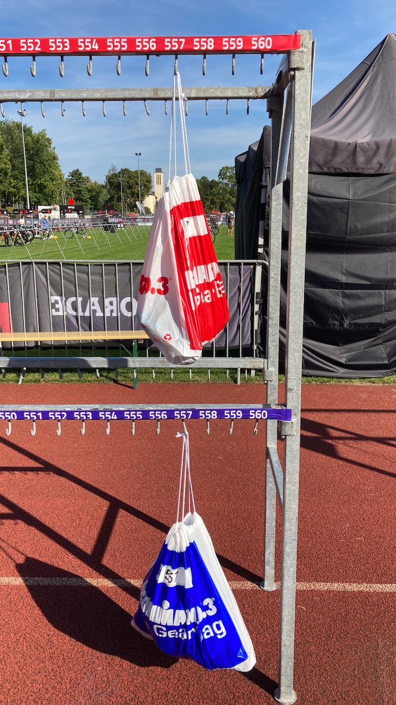
	<figcaption>Transition Bags</figcaption>
</figure>
</a>

## Race Day

Naturally, I was very nervous. Despite all my preparations and planning there were too many variables and many things could go wrong.

### Pre-Race Preparations

And some things did go wrong.

After arriving to the transition zone I realised a few things:

1. I cannot unmount my bike from the rack anymore because my neighbours are too close and I cannot lean my bike to the necessary angle.
2. My whole bike is covered with water from the condensation and I only have dry chain lube with me.
3. Perhaps because of the direct sunlight or the condensation the straw magnet on my front hydration system came off. To be fair it was super glued by me and not by the manufacturer.

I could not do anything about the first problem, it's not allowed by the rules to touch other bikes in the transition area and judging by the looks of the bikes, their owners had already done all the preparations and left to the start line. So, I just hoped for the best.

### Swim

<a href="2023_IM_Swim_1.jpg" target="_blank">
<figure>
	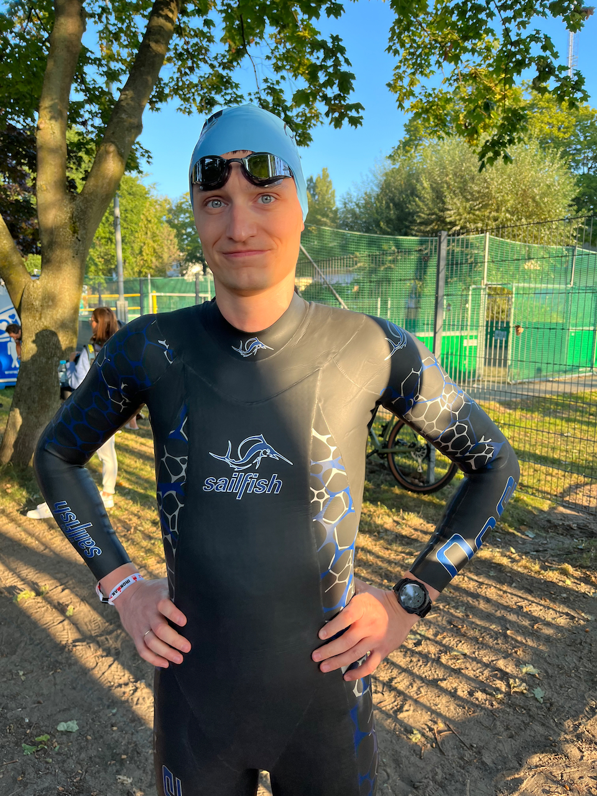
	<figcaption>Nervous before the start.</figcaption>
</figure>
</a>

<a href="2023_IM_Swim_2.jpg" target="_blank">
<figure>
	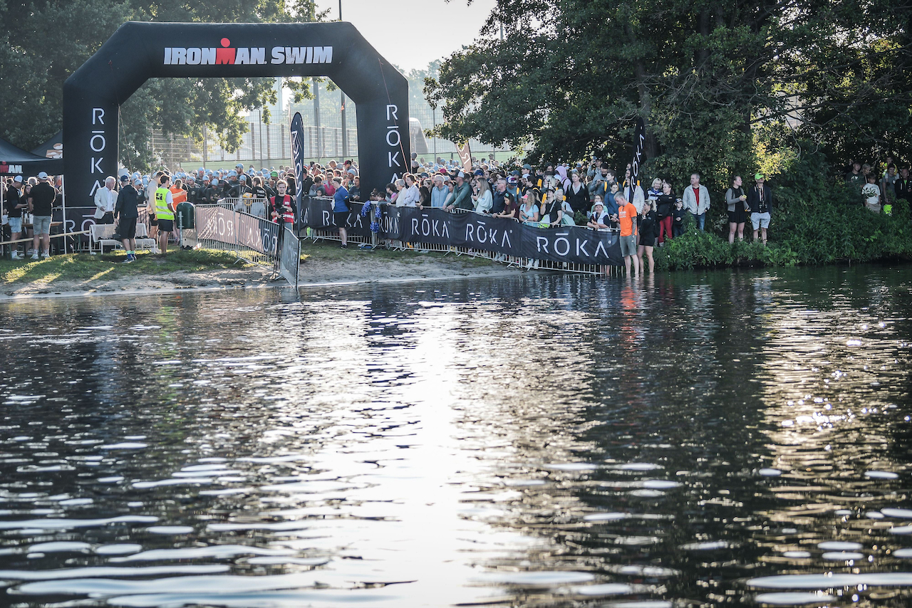
	<figcaption>Start line.</figcaption>
</figure>
</a>

This time I was wearing my wetsuit and it also was a rolling start which was so much better. The only thing I struggled with was the distance between buoys. Sometimes they were too far from each other and I simply didn't see the next one. When this happened, I just followed other people and it worked out just fine.

<a href="2023_IM_Swim_3.jpg" target="_blank">
<figure>
	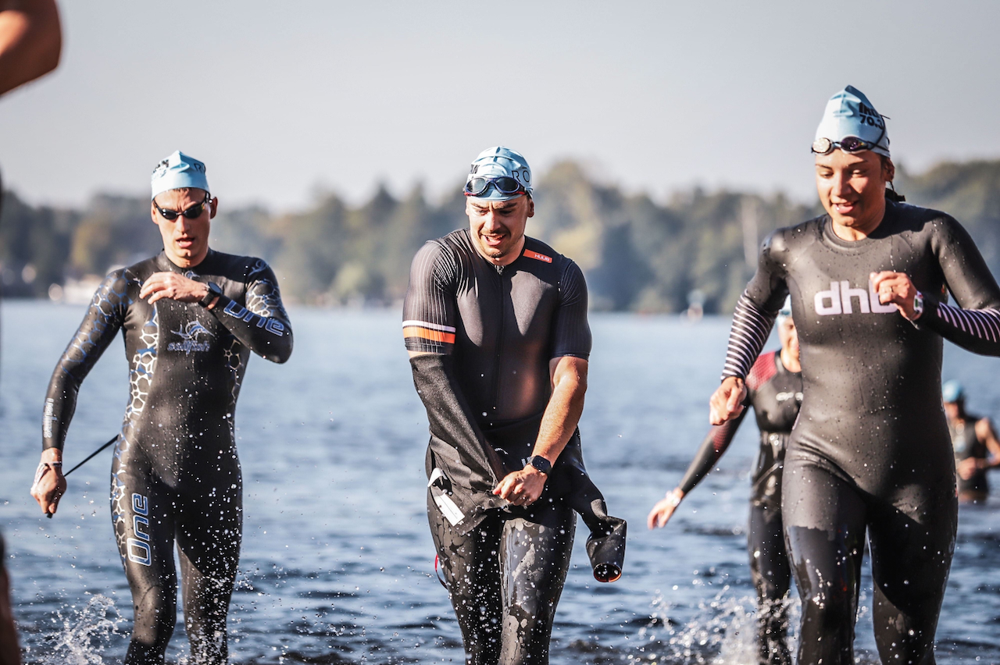
	<figcaption>Exiting the water.</figcaption>
</figure>
</a>

### Bike

T1 went smoothly. Remember the problem with my saddle being too high and I needed to lean the bike to unmount it? Luckily for me, one of my neighbours was already gone and I could lean and unmount my bike just fine. One thing though: somebody took 2 of my gels attached to the bike. I mean seriously? One could just get them on the course, why? Luckily (again) I had 3 more gels in the bento box, so I was still fine but was 2 gels short during the bike leg and it was risky.

Then I made the classic mistake of kicking my saddle bottle out of the cage while mounting on the bike, I put it back and off we went.

The bike leg was mostly fine except this one crazy guy who ignored and broke every possible triathlon rule. He was cutting people off, drafting, overtaking in 3 lanes and acting very dangerously most of the time. People were shouting at him but it didn't help much. First, I figured it would be better to overtake him and I did but then he overtook me back and went further ahead in a sprint. Few minutes later, I see him smashing into an oncoming triathlete. At least I think that's what I saw. The ambulance was on its way. There was blood, injured people on the ground, etc. Hopefully everyone was okay in the end.

Besides the road being very narrow in places and referees not catching that crazy guy before the crash, I don't really have anything bad to say about the organisation. Signs and markings were very clear, assistance up the level.

One unfortunate thing that happened to me at ~70 km in: a bolt on my front hydration system got unscrewed after hitting a pothole and the whole thing started disintegrating. I caught some parts but also lost some and now I cannot use it anymore.

<a href="2023_IM_Bike.jpg" target="_blank">
<figure>
	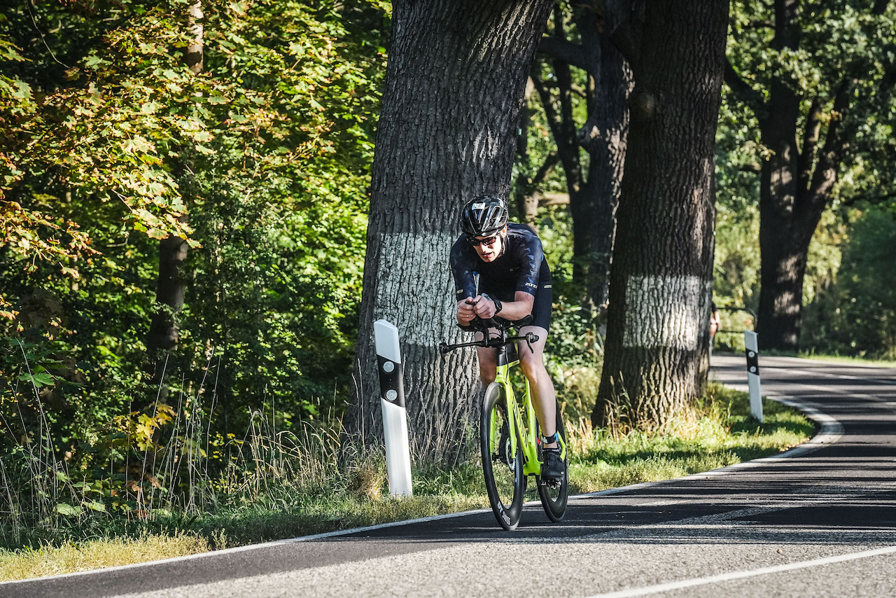
	<figcaption>Bike leg.</figcaption>
</figure>
</a>

The closer to the transition zone we got, the more supporters surrounded us, the louder it got. It was a very nice experience. I finished the bike with, as I thought, fresh legs and was looking forward to the run.

### Run

T2 was quite uneventful and I started my half marathon. Surprisingly, my legs refused to work for the first 4-5 km but then they started getting back to life. Unfortunately, this is when I finally started to feel the heat. It was 31 C on the day but thankfully some locals started spraying triathletes with cold water out of their garden hoses. And we had a spot like this almost every 500m. This was amazing. Nobody asked them to do that, they just self-organised and this help and care was very appreciated. This is the level of support you get in Erkner. Additionally to that the aid stations had ice cubes that I occasionally threw in my trisuit, this helped a lot.

The run consisted of 4 loops. On each loop the volunteers gave you a hair tie of a different colour. When you collect 4 different colours you head for the finish line. With my confused overheated head, after the first loop I collected the wrong colour. I realised that after 10m and turned straight back to exchange it. It was very dumb on my side and, of course, I almost collided with another triathlete head to head doing so.

I initially planned for a 4:30 min/km pace but because of the heat I had to adjust and lower my expectations. So, the total average was around 4:43 min/km instead. I would not call that run steady though.

<a href="2023_IM_Run.jpg" target="_blank">
<figure>
	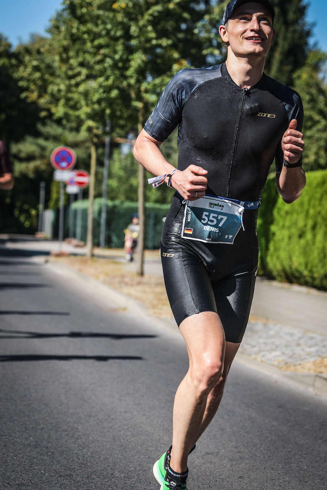
	<figcaption>Run.</figcaption>
</figure>
</a>

### Finish

Only after collecting the last hair tie did I realise: "wait, am I finishing now? for real?". Finally, I could take the road where the "To Finish" sign pointed. While getting closer to the finish line people were cheering more and more. Around 200m to the finish line one of the security guys shouted "you look too fresh!" at me. Which made me laugh and I took it as a huge compliment. No matter if he says it to everyone or just me.

I had never looked at my total time during the race, I focused on the current leg which helped me mentally. Now approaching the finish line I looked at the screen on the finish arch and I saw my time -- 5:08:48. I could not believe it. My goal was around 5:30:00 with a better half marathon pace. Looks like my last moment bike purchase gamble really did make a difference.

<a href="cover.jpg" target="_blank">
<figure>
	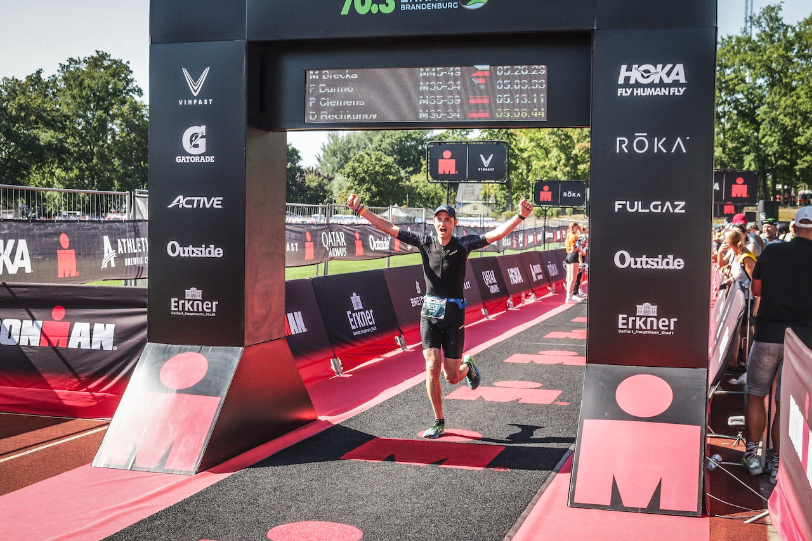
	<figcaption>Finish.</figcaption>
</figure>
</a>

The finish area, or "athletes garten" as they call it, was great: they had a couple of open cold showers, water, fruits, cakes and a lot of happy triathletes.

I went to have a proper shower, met my wife, picked my bike and went to find our friend who offered his help getting back home.

<a href="2023_IM_Finisher.jpg" target="_blank">
<figure>
	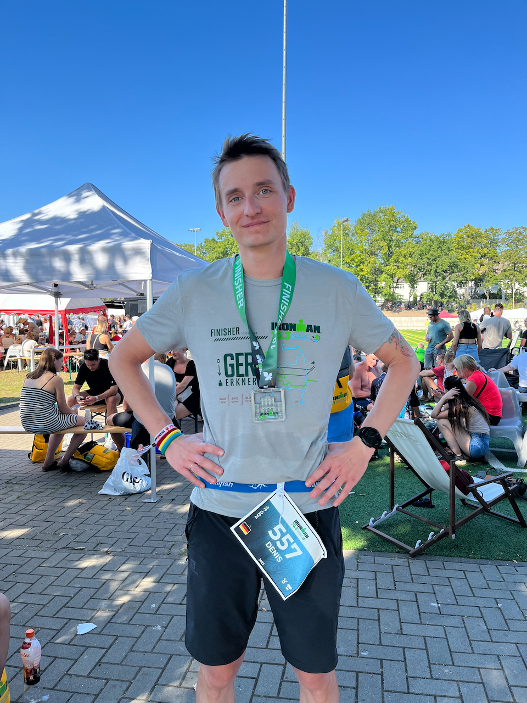
	<figcaption>Finisher.</figcaption>
</figure>
</a>

# Bragging Section

To summarise I'd like to put here the list of races I finished to this day:

When                 | What                            | Distance | Result
---------------------|---------------------------------|----------|---------
August 3rd, 2019     | [adidas Runners City Night](https://api.results.scc-events.com/cert/4675?ei=CN&y=2019) | 10 km | 49:02
September 6th, 2020  | [Virtual Wizz Air Budapest Half Marathon](https://connect.garmin.com/modern/activity/5494210790) | 21.1 km | 1:41:57
November 14th, 2020  | [Virtual Helsinki10](https://connect.garmin.com/modern/activity/5818426882) | 10 km |  44:50
April 18th, 2021     | [Virtual Leipzig Marathon](https://connect.garmin.com/modern/activity/6628001603)| 42.2 km |  3:57:06
August 22nd, 2021    | [40. Generali Berlin Half Marathon](https://connect.garmin.com/modern/activity/7348398864) | 21.1km | 1:46:10
July 2nd, 2022       | [Parkrun Hasenheide](https://connect.garmin.com/modern/activity/9124225590) | 5 km | 20:11
September 11th, 2022 | [37th Wizz Air Budapest Half Marathon](https://connect.garmin.com/modern/activity/9582815972) | 21.1 km | 1:43:18
September 25th, 2022 | [48. BMW Berlin Marathon](https://connect.garmin.com/modern/activity/9672336640) | 42.2 km | 3:38:01
October 16th, 2022   | [degewo GREAT 10K](https://connect.garmin.com/modern/activity/9799792004) | 10 km | 41:11
October 23rd, 2022   | [16. Müggelsee-Halbmarathon](https://connect.garmin.com/modern/activity/9841483292) | 21.1 km | 1:36:43
April 2nd, 2023      | [41. Generali Berlin Half Marathon](https://connect.garmin.com/modern/activity/10818092620) | 21.1 km | 1:29:05
June 3rd, 2023       | [Innsbruck Alpine Trailrun Festival K85](https://connect.garmin.com/modern/activity/11261102047) | ~92 km/~4000 m of elevation gain | 17:18:58
July 8th, 2023       | [Werbellinsee Triathlon. Olympic distance](https://connect.garmin.com/modern/activity/11514268422) | 1500 m/38 km/10 km | 2:39:38
July 29th, 2023      | [adidas Runners City Night](https://connect.garmin.com/modern/activity/11670235079) | 5 km | 18:58
September 10th, 2023 | [IRONMAN 70.3 Erkner](https://connect.garmin.com/modern/activity/11990565134)     | 1900 m/90 km/21.1 km | 5:08:48
September 24th, 2023 | [49. BMW Berlin-Marathon](https://connect.garmin.com/modern/activity/12094100058) | 42.2 km | 3:15:03

And it all started with an inspiring commercial.

Honestly, writing this post really helped me to see the whole picture of the journey I went through during these years. I didn't realise how many things have happened since 2018. This was a big life change and healing experience that helped me find myself again and start receiving joy from life.

# What's next

Full IRONMAN next year? Perhaps a sub 3 hour marathon? Who knows, I'll keep you updated. But I'm definitely interested more in triathlon races now, it's way more fun.
