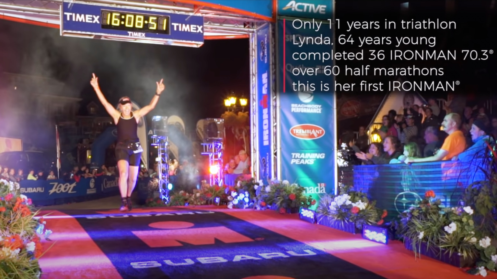

# Short Answer

The short answer is:

> It makes me happy, it makes me better

Not satisfied? Welcome to the long version...

# Long Answer

I always hesitated to give a long answer in person. Mainly, because it required me to communicate so many things in a short amount of time and, most likely, I would not be able to find the best words to do so. Fortunately, smart people invented writing which allows us to be better at choosing the best words.

## Superpower

Have you ever dreamed of getting superpowers? As a kid raised on cartoons and movies about superheros, I have. Of course my dreams shattered when I realized it was all fiction. Until later I realized not everything was.

You see, running on a regular basis for months makes some significant changes in your body giving you some sort of superpowers comparing to people who don't do sports:

* Your heart becomes stronger and needs fewer beats per minute to pump the same volume of blood, that's why [athletes have a lower resting heart rate](https://www.ahajournals.org/doi/10.1161/circoutcomes.6.suppl_1.A311) which can reach as low as 38 beats per minute. Your maximum heart rate normally remains almost unchanged (slowly decreases with age) which increases your capacity to perform.
* Your muscles get more [mitochondria](https://www.ncbi.nlm.nih.gov/pmc/articles/PMC1540458/) which allows them to produce more energy and therefore improve your aerobic energy system. That lets you to longer sustain a low to medium intensity effort, like running a marathon. It also decreases your effort level with faster paces. Simply speaking, you get tired less from doing even more.
* Running makes you more mobile and trains your muscles (and not just legs: core, back muscles are also involved).

Does not sound that impressive?

Okay, what about swimming 3.8 km in 54:39, then cycling 180 km in 4:31:14, then running 42.2 km in 2:45:49 with a total time of 8:18:20? Just imagine running a marathon with the pace of 3:56 min/km after cycling 180 km.

This is how [Laura Philipp performed in IRONMAN Hamburg 2022](https://youtu.be/1928WYI3Vmo?t=30779). And it's simply a result of her very hard work and determination through the years.

What about running just a marathon in 2:01:09? That's 2:52 min/km, almost 24 km/h. And this is the world record [Eliud Kipchoge set in the Berlin Marathon in 2022](https://berlin.r.mikatiming.com/2022/?content=detail&idp=HCH3C0OH5454F&lang=EN_CAP).

Things like this look completely out of reach to people distanced from sports. What is it if not superpowers? These people were not born with this level of performance, it's all they gained through the years of hard work and focus.

People usually describe all of these things above by a single word "fitness". And I can tell you: a high fitness level is very addictive.

Only if you stop running after a long duration of regularly doing so, you can actually feel how far your fitness has gone. You feel like your superpowers are melting away with each day and you know how much hard work it requires to get them back. It's much easier to maintain the same level of fitness for years than to come back to the same level after a long break. Getting back to running is frustratingly slow and has a high risk of injury because your mind cannot accept your much lower performance and will likely force your body to overtrain.

This is what most of the people don't get, this is why running (or any sport for this matter) is so addictive. I can feel this contrast in how I'm getting so weak after I stop my training and it's extremely frustrating. It's like feeling seriously ill.

If you had superpowers and suddenly felt them disappear, I'm sure you would do something to keep them.

You think I exaggerate?

It's not just my running performance and how far and how fast I can run. It's in my daily life too. It's how I can walk upstairs for 5 floors without catching my breath, it's how I can hike up a mountain for hours without getting tired or commuting on a bike at 30 km/h without getting tired. Fitness gained with running transfers to many other areas of your life, it becomes very obvious, so does the loss of it.

Fun story:

Once, on one of my long runs in Berlin, some stranger (~18 y.o.) suddenly left his friends and started running along with me. His intent (how I understood it) was to troll me. He started asking questions like "Why are you running? Is it something scary behind you? What are you running from?" but after 30 seconds he could not breathe anymore and had to stop, bend over and cough.

"Funny", I thought, "a guy twice younger than me cannot maintain my easy pace for even 30 seconds. I wish he used his strong trolling motivation to start running instead".

## Willpower

It takes more willpower than physical strength to run a marathon. Even if you have enough fitness to run a marathon but your willpower is weak, it's over.

I automatically have a lot of respect for every person who finished a marathon. I have a huge amount of respect for [IRONMAN 140.6](https://en.wikipedia.org/wiki/Ironman_Triathlon) and ultramarathon finishers.

A long endurance event is a constant fight with yourself: your body is screaming to stop. Your mind is constantly trying to find an excuse why you should stop right now and drop out. I guess it's some kind of self-preservation instinct because your body detects how much energy loss it's going through.

But you know what? Every time I pushed through it, I learned something about myself. I learned how I can sustain a very difficult activity for a long time and how to endure what seemed impossible. It also translates to your daily life, when you see an impossible task at work or you're going through something difficult in your life.

Every following "fight" gets easier because I already know what to expect and how to deal with it. Which brings us to the next point.

## Finding My Limits

I'm yet to hit my limits and I'm curious where they are. When I started running in 2019 once I turned 30, I thought "Wow, people run 42 km? That's insane! Those people are completely nuts, I will never reach that level". And that was even before I learned about [IRONMAN](https://en.wikipedia.org/wiki/Ironman_Triathlon) and ultramarathons. Only 2 years later I ran [my first 42,2 km](https://connect.garmin.com/modern/activity/6628001603). Next year I [improved my marathon time by 19 minutes](https://connect.garmin.com/modern/activity/9672336640).

By doing this I learned the actual truth about my limits -- I don't know them yet. I might be able to finish a full [IRONMAN](https://en.wikipedia.org/wiki/Ironman_Triathlon) race, or perhaps run a 160 km ultramarathon in the mountains. How would I know without trying? So far it seems like it's a matter of time and commitment to my training. Until I hit my actual limits I will be trying new challenges to test them.

Entering races is one way to do it -- a well-organized, controlled and safe environment where people support you in your next attempt to test your limits. Naturally, everyone wants to win the race: for some people it's to finish first, for others it's to exceed their previously reached limits. And I must say, it feels very good to extend my limits, not many things can compare to that.

I suppose this should answer a regular question I get: "Why do you enter all these races? What's interesting in suffering and paying money for it?"

## Me Time

Another regular question I get is: "What do you do during your long runs? It must be very boring to run 20-30 km".

This gives me a smile every time I hear it.

It's the only time of my day when I'm undisturbed for hours with no distractions. My entire life I've been struggling to focus. It's very easy for me to get lost in my thoughts while doing something or to get distracted by something and completely forget what I was thinking about. For this reason I always write everything down and maintain lists in my daily life, I never trust my mind.

Surprisingly, while running, despite all the street noise, I can focus on any thought I want. I think about how to solve my current life issues or problems at work. I can plan my life ahead and work on some creative ideas. Sometimes, I choose to listen to an audiobook which, normally, I would not have enough patience to do.

Also, on my long runs I try to plan some routes that I have not taken before to explore more local areas, parks, forests, etc. If that's the case, I try to look around as much as possible and there is no time for boredom.

## Why Not Other Sports

This question is way more reasonable than the rest of the bunch.

I think any sport with a prolonged aerobic activity would have a similar effect (e.g cycling or rowing) but here is why I think running is more reasonable to choose:

* Running is one of the basic activities that you do in your life -- you walk and run, so basically you train what you use daily.
* Running is more accessible: yes, you need running shoes, a sports watch and some sports clothes but it's not the same as buying an expensive bike and you don't have to go somewhere special to have a workout session.
* It's generally safer than cycling, for example. Since the speeds are higher on a bike, the crash injuries tend to be more serious too.
* Running is one of the most energy consuming sports despite being one of the simplest, so if you're looking for easier ways to cause calorie deficit for your diet, here it is.

## Health Benefits

I know, I've touched on that in the "Superpowers" section but there is something else I want to talk about.

We're all getting older and doing sports is proven to [slow down the aging process](https://academic.oup.com/eurheartj/article/40/1/34/5193508) and [reduce some health risks](https://bjsm.bmj.com/content/54/15/898).

It's especially [relevant](https://www.ncbi.nlm.nih.gov/pmc/articles/PMC2996155/) for people who have a desk job. As a software engineer, I'm personally in the risk group, so it's very likely that my running is my life saver.

Also, you don't even need to read a study to see the obvious. Just have a look at older people who maintain their active lifestyle versus those who don't. After I moved to Berlin I was shocked how often I was getting overtaken by old ladies on a bike. After some time I learned that active lifestyle is simply more common among older people in Germany which results in some 26 year old guy like me questioning his life choices. At the very least it's noticeable how many people commute on a bicycle here, no matter the age.

What I personally learned from my observations: if people stop moving and being active with age they become immobile very quickly. And it's very difficult to reverse. Easier to remain active.

Just to give you an inspiring example:

This picture is taken from the [video on YouTube](https://youtu.be/qUHsIMhe0qQ?t=708), I highly recommend you watch it.

I also very liked the quote at the end of that video:

> Only those who will risk going too far can possibly find out how far one can go.

TS. Elliot

# Word of Caution

Inspired to start your running journey? Awesome! But hear me out:

One cannot simply run as hard as they can every day and get the benefits, this is the shortest way to an injury.

Experienced runners run very easy ~80% of the time and run hard the rest 20%. "Easy" is relative and one's "easy" can be an impossible pace for another. We all come from different backgrounds, hence different levels of fitness to start with.

Find an experienced runner you can ask for advice from or even hire a coach if you can afford it. Do a lot of research, be proactive and remember that comparing yourself to others is toxic. Compare to your past self and race against yourself not others.
