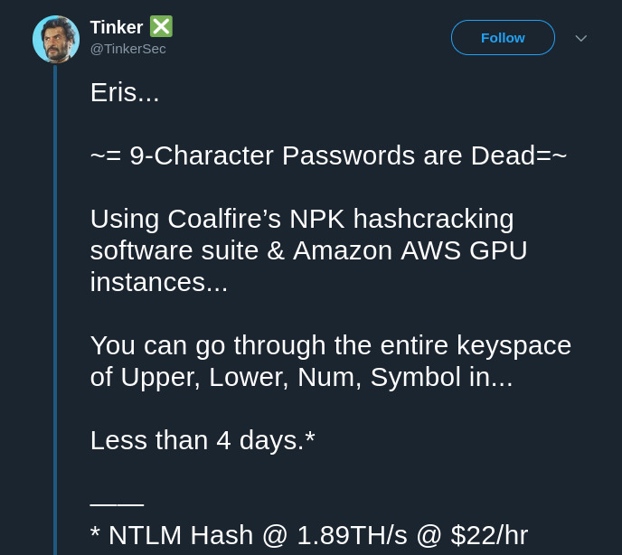
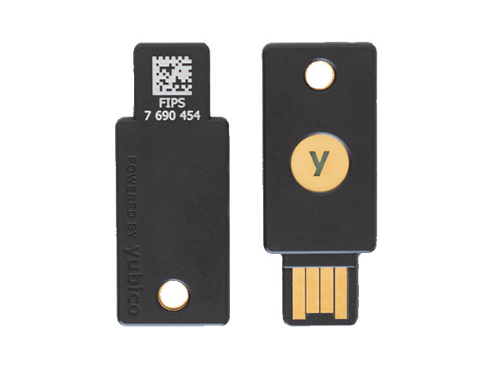

Recently I gave a talk to my colleagues where I shared some tools I use to secure my online presence and communication. Some of the listed things can be very technical but some of them I believe are crucial to know as a part of the daily life in the modern world.

# Disclaimer

I'm not a security expert, please check every word I write.

Although, I have some experience in basic pen-testing and I have exposed some vulnerabilities in the past, I don't consider myself an expert in this area. There are people out there whose full-time job is information security and I'm not going to pretend I'm one of them. I just do some [CTFs](https://en.wikipedia.org/wiki/Capture_the_flag#Computer_security) as a hobby and build software as my daily job, so it gives me enough knowledge to write such articles and give such talks but does not make me an expert.

# Authentication

Let's immediately start with one of the most important things in the modern world — [Authentication](https://en.wikipedia.org/wiki/Authentication). If you don't know what it is — simply speaking, this is what happens when you type in your login and password somewhere and then click "Login". And a password is still the most common authentication method nowadays which is, in my opinion, a bit unfortunate.

Why?

## Always changing requirements

You see, requirements for strong passwords depend on what hardware power is available at the moment and because of that the requirements are constantly changing. Same happens to the encryption and cryptography in general but this is hidden from us users by the software and tools. A password is something people used to create themselves based on their memory and association.

So, the requirements in March 2019 are:

### Must be more than 9 characters

[The recent benchmark](https://twitter.com/TinkerSec/status/1096046635593928704) showed that a random 9 character long password can be guessed within 4 days using the AWS cloud GPUs. In comparison, just around a month before this [another benchmark was published](https://twitter.com/TinkerSec/status/1096046635593928704) where it claimed that 8 character long passwords can be cracked in ~2.5 hours with modern desktop hardware.



### Can not contain words, must be random

If you have words in your passwords it's likely to be used against you. There are dictionaries and software that can generate permutations of different words from these dictionaries to crack your password. So, it's better not have words in your passwords.

### Must contain numbers and special characters

The larger your password alphabet the better. The complexity of password cracking depends on the size of the used alphabet, so don't limit yourself to using alphanumeric passwords only.

However, [there are still web-sites](https://arstechnica.com/information-technology/2013/04/why-your-password-cant-have-symbols-or-be-longer-than-16-characters/) that require you not to use special characters or long passwords (surprisingly, even some banks) which is ridiculous and should not be a thing in 2019.

### Must be different for each service/web-site/system

This one is **extremely** important. I can't emphasize enough how important it is and it's all because you don't know how different web-sites store and process your passwords.

Typically, a password is transferred via encrypted data channels directly to the server where it's immediately hashed with a strong [hash function](https://en.wikipedia.org/wiki/Cryptographic_hash_function) and **the hash string** (not your password) is stored in the database. In this flow, it's very unlikely for the service or their employees to know what exactly you put in that password field.

If you don't know what a hash is — it's a cryptographic tool that converts your password to a different string and this operation is irreversible, so nobody can easily guess the initial content. But if two strings are the same they usually produce the same hash string and this is how you can compare if the user sent a correct password next time. However, some hash functions don't even produce the same string for the same password twice but they are still able to compare if the password value is the same as it was set previously. This is even more secure and supported by [bcrypt](https://en.wikipedia.org/wiki/Bcrypt), for example.

Even if your password is 1 character different from another the hash will be a completely different string, so you can't tell seeing two hashes that 2 passwords are alike.

This is how it should be properly done but you would not believe how often you can find web-sites where:

* Passwords are not transferred via encrypted channels and can be easily intercepted (no HTTPS)
* Strong hash functions are not used. It's important because old hash functions like [MD5](https://en.wikipedia.org/wiki/MD5) can be very weak for the current hardware and the passwords can be cracked in a matter of hours.
* Sometimes, passwords are even stored unhashed in plain-text and employees have direct access to them. They might also want to sell these passwords.

You might think "I'm not using suspicious web-sites built by non-professionals, so I'm safe".

But are you? The fact is — you'd never know:

* [Twitter](https://www.reuters.com/article/us-twitter-passwords/twitter-says-glitch-exposed-substantial-number-of-users-passwords-idUSKBN1I42JG?il=0) was logging plain-text passwords till May 2018
* [GitHub](https://gizmodo.com/github-tells-some-users-it-accidentally-stored-their-pa-1825702783) was also logging plain-text passwords till May 2018
* [Facebook](https://www.theguardian.com/technology/2019/mar/21/facebook-admits-passwords-unprotected) stored plain-text passwords for years

In all these cases above your passwords were exposed to the employees of the listed companies, would you trust all these hundreds or maybe even thousands of people?

This brings us to the point of having different passwords per service as a **MUST**. Yes, your password for Facebook can be compromised and someone else knows it but at least they don't know passwords for all the other services and web-sites you're using because there you have a different password.

## How do people crack passwords?

I talked much about cracking your password but how is it actually done?

There is special software like [hashcat](https://hashcat.net/hashcat/) which is able to leverage the whole power of your hardware including GPUs and generate all the possible combinations of given characters or words. What is more important though, it can also generate any type of hash from this combination and test if it matches the given hash you already have.

And, as far as I know, this is the main way the passwords get cracked. Most of the time people don't try to make millions of attempts to login on the real web-sites because they usually have protection against it (like [CAPTCHA](https://en.wikipedia.org/wiki/CAPTCHA)). Instead, they get a hash from somewhere like database leaks or exploiting some vulnerabilities on a web-site and then run a cracking session with hashcat on a very powerful hardware.

Again, if you use the same password everywhere it takes only one successful session like this to get access to all your services and data.

To check if your password hash (or maybe even plain-text) has been ever leaked you can use this website [haveibeenpwned.com](https://haveibeenpwned.com/). But I would not recommend to type your password on any similar web-site to test if it was leaked, this sound more like phishing to me.

## We're only humans

As you might have noticed, strong passwords are hard and we're only humans who can do so much. Creating and memorizing really strong passwords which are totally different for each use is impossible for most of the people.

What is possible though is **not writing down you passwords anywhere**. I know, for some people it sounds funny but I'm pretty sure for people who exposed their passwords on TV in live interviews it was not that funny. It happens quite often, by the way, check [this article](https://www.itgovernance.co.uk/blog/four-embarrassing-password-leaks-on-live-tv) out.

So, the solution is simple — password managers. Don't get me wrong, password managers are not 100% secure either and they also [can leak your passwords](http://devd.me/papers/pwdmgr-usenix14.pdf) but in most situations it's much better than having an insecure password.

To be completely honest, I was skeptical about password managers for a long time, mostly because they work using browser extensions and it's not clear how they store your passwords.

## pass — the standard Unix password manager

But that was until I found [pass](https://www.passwordstore.org/) — the standard Unix password manager. It's basically a long bash script that works with GPG and Git. This is exactly what I was looking for — total control and transparency over storing and generating your passwords. I trust GPG, I trust Git and I can decide myself where to store my encrypted passwords and who is exactly able to decrypt my passwords. It's a very simple to use CLI tool which has a variety of 3rd party clients and extensions (e.g. for Android) which makes it possible to use this password manager anywhere you want if you decide so.

Obviously, you need to have a pair of GPG encryption keys and a Git remote before you can use it. [GitHub](https://help.github.com/en/articles/generating-a-new-gpg-key) has a simple tutorial how to generate GPG keys but I'd recommend to understand the master key and sub-keys concept and be [more advanced](https://github.com/drduh/YubiKey-Guide) about your keys, read further in the article.

Once you have your keys generated, it's simple as:

```bash
pass init <your-email-from-key-uid>
```

You can also specify multiple key uids and it will be encrypting your passwords for all of them. This command is also used when you need to re-encrypt the whole password storage to use different encryption keys (you need to have both on your machine at the same time though).

This command will create `~/.password-store` directory for you which is a Git repository and you can go and add your remote there.

Generate a new password:

```bash
pass generate -c <name-of-the-service>
```

Noticed the `-c` flag? That means you won't see the password itself, it will be copied to the clipboard for 45 seconds and then erased. So, in fact I've never seen my passwords.

If you need the password again just:

```bash
pass -c <name-of-the-service>
```

Same here, it's copied to the clipboard for 45 seconds, then erased.

As I said, the password store is a Git repository and each password generation or storage re-encryption is a Git commit. In order to back your storage up you use:

```bash
pass git push
```

So, the command performs some extra operations around Git if needed, therefore it's wrapped.

If you're wondering how the command works just do:

```bash
less $(which pass)
```

As I said, it's just a long bash script and you can easily learn how it works.

I like so much how simple and elegant it is. Highly recommended.

## Passwords alone are not secure — you need 2FA

It's always good to have a strong password but unfortunately it's not enough, passwords alone would not prevent you from being hacked.

But I have good news, there is an additional security tool that you can use — 2-factor authentication (or multi-factor authentication, in general).

In my entire life, I've never heard anyone saying "My account was protected by 2-factor authentication and it got hacked". So, use it! Especially, because most of the services support it nowadays and if some don't — shame on them.

### What are the options for 2FA?

* SMS code — simple, does not require anything you don't already have but the least secure option on the list because [SMS can be intercepted](https://security.stackexchange.com/questions/11493/how-hard-is-it-to-intercept-sms-two-factor-authentication).
* Authentication App like [Google Authenticator](https://play.google.com/store/apps/details?id=com.google.android.apps.authenticator2&hl=en_us) — time-based codes that change every 30 seconds. Can be difficult to regain access if your smartphone dies or gets stolen though.
* Security token like [YubiKey](https://www.yubico.com/products/yubikey-hardware/) — is my favorite option that I use myself. In simple words, you plug a USB device in, touch it with a finger when a website asks you and it's done. So, you don't have to type in any code at all.

All 3 options require you to set it up first, of course, and you can remove it anytime if you think it could be compromised (e.g. your security token got stolen).

## In the future we won't need passwords

")

Recently the [WebAuthn specification](https://w3c.github.io/webauthn/) was finalized and it's a big deal because this is a type of web authentication based on [asymmetric cryptography](https://en.wikipedia.org/wiki/Public-key_cryptography) (public/private key pair).

Asymmetric cryptography is an extremely powerful tool and it's basically what GPG uses for encryption by default or what you use when you sign your commits in Git. The whole idea behind it is that you have a pair of keys not a single key or password. The pair of keys consists of **public** and **private** keys. I'm not going to dive deep in details how it works, anyone can read it on [Wikipedia](https://en.wikipedia.org/wiki/Public-key_cryptography) but here is a couple of use cases for you:

* You share your **public** key on the internet, everyone who get it can encrypt their data using this key, but nobody can decrypt the data unless they have a **private** key that corresponds to the used **public** key.
* You sign your data with a **private** key and share your **public** key on the internet. Everyone who has your **public** key can verify that this data has been genuinely signed and sent by you. This is exactly how [signing your Git commits](https://git-scm.com/book/en/v2/Git-Tools-Signing-Your-Work) works.

And this is the technology that stands behind the new [WebAuthn standard](https://w3c.github.io/webauthn/). Your device (usually a security token, e.g. YubiKey) generates a new key pair and stores it sharing a **public** key with a website during registration. The websites stores the **public** key in its database and when you try to login it sends some data to your security token and asks to sign it with a **private** key, once the signed data is received back the website verifies using the **public** key that this data has been genuinely signed by the user who put the **public** key during the registration in the first place.

Your device can ask for a second factor like a PIN code or can be even a biometric device like a fingerprint scanner. So, it's the most secure authentication method for the Web at the moment.

The best thing is the information that the web-site stores is **public** because, you know, it's called "public key" after all and even if this information gets leaked some how it's useless for attackers because the only thing they can do with it — let you login somewhere.

Despite the fact this standard is quite new it's supported by the majority of the browsers at the moment. All modern versions of desktop and mobile browsers [support it right now](https://caniuse.com/#search=webauthn). Except Safari supports it in the experimental mode only but I hope not for long.

If you happen to have a new YubiKey (5 gen) or an Android smartphone with a fingerprint reader go to the [webauthn.io](https://webauthn.io/) and try to register and login using their demo.

Also, there is a cool and simple tutorial on [webauthn.guide](https://webauthn.guide/) that explains in simple words how it works.

# Phishing

Okay, I hope we've clarified some things about authentication now and we can talk about another very important topic — phishing. Yes, cracking passwords is a thing but most of the time attackers don't even need to crack passwords because they trick people into giving up their credentials.

Do you remember that time when a lot of private pictures of celebrities got leaked all over the internet?

People called this terrifying event [Celebgate](https://en.wikipedia.org/wiki/ICloud_leaks_of_celebrity_photos) (because, you know pictures leaked from iCloud).

According to [Washington Post](https://www.washingtonpost.com/news/the-intersect/wp/2016/03/16/the-shockingly-simple-way-the-nude-photos-of-celebgate-were-stolen/), during the investigation process it was found that:

>Collins [person responsible for the attack] allegedly gained access by setting up emails designed to look like official accounts associated with the Google or Apple services used by his celebrity targets.

So, basically this guy just used phishing emails and it made this huge data leak possible.

Fortunately, for all of us it's very simple to avoid phishing attacks — **just check the URL**. When you see a page that asks for any input always check the URL in the address bar of the browser, it can look very similar and it can be just one character different but it's extremely important to check a URL and make sure it's a genuine page that asks for your credentials.

You might be surprised to know that there are whole frameworks like [this one](https://github.com/thelinuxchoice/blackeye) that serve attackers who want to impersonate or replicate existing social network login pages.

# PGP — Pretty Good Privacy

[PGP](https://en.wikipedia.org/wiki/Pretty_Good_Privacy) is a set of cryptography tools mainly used for private communication.

The more popular implementation though is [GNU Privacy Guard](https://en.wikipedia.org/wiki/GNU_Privacy_Guard) (GnuPG/GPG). GPG is available for the majority of platforms and very commonly used, as I mentioned talking about pass (password manager) earlier.

In my opinion, it's the most reliable cryptography suite at the moment.

I think it's really important for everyone in the modern world to know how to use this tool because it's a trusted way to keep your data private and avoid its unauthorized usage, especially if you take into account how simple to use it.

## Modes

GPG can operate in 2 modes:

* Symmetric — when you just encrypt a file with a given passphrase that you come up with
* Asymmetric — that's something I've already mentioned when talked about the password manager. You generate a pair of keys: private and public, you encrypt with a public key and decrypt with a private key.

### Symmetric

### Encrypt your data

Let's create a file:

```bash
echo "The very secret text" > secret
```

And then encrypt it, so we can store it somewhere safe:


```bash
cat secret | gpg -ac
```

* `-a` stands for "armor" which basically outputs a Base64 encoded format instead of binary, so you can copy-paste this text and send via any chat or email client. If you're fine with a binary format you can remove this flag and redirect the output to the file adding ` > secret.aes` at the end.
* `-c` stands for "symmetric mode"

The command will prompt you to enter the encryption passphrase.

Then you'll see the encrypted output, something like this:

```
-----BEGIN PGP MESSAGE-----

jA0ECQMKexM2SxYG1FD20lABN/cH50hWiVv64aZBeOohfwJ6m1AvQdy/dcY3VOjO
I7ZKahIccOYioxdBsdPIhvJiyOY54HDpJxVlaOq0bxly/eYghlKo3WYWwiE4MKee
FA==
=zN+h
-----END PGP MESSAGE-----
```

By default, GPG uses "AES with 256-bit key salted & iterated - SHA512" encryption mode which is supposed to be the strongest symmetric encryption algorithm at the moment. So, you can store this encrypted text and only if you know the previously set passphrase you can decrypt this data back. I personally, encrypt all my backups like this and store them in the cloud.

### Decrypt your data

Simply use this command:

```bash
cat secret.aes | gpg -d
```

`-d` stands for `decrypt`

You'll be prompted to enter the passphrase you've set earlier and then you'll see the plain text data like this:

```
gpg: AES256 encrypted data
gpg: encrypted with 1 passphrase
The very secret text
```

### Asymmetric

#### Generate your keys

As I mentioned earlier, there are some options how to generate your keys but the simplest way is just to follow the GitHub instructions [here](https://help.github.com/en/articles/generating-a-new-gpg-key). It's not the best practice though, the more advanced tutorial is [here](https://github.com/drduh/YubiKey-Guide#creating-keys).

#### Encrypt your data

Again let's create a file that we're going to encrypt:

```bash
echo "The very secret text" > secret
```

Then, in order to encrypt this file, you just need this short command:

```bash
cat secret | gpg -aer <your-email-here>
```

* `-a` stands for "armor" which basically outputs a Base64 encoded format instead of binary, so you can copy-paste this text and send via any chat or email client. If you're fine with a binary format you can remove this flag and redirect the output to the file adding ` > secret.gpg` to the end.
* `-e` stands for "encrypt"
* `-r` stands for "recipient" which is a uid of a public key (usually a email address). If you want to encrypt data for someone else, you need to import their public key go GPG first. Usually `cat key.pub | gpg --import` is used for this.

Then you'll see something like this:

```
-----BEGIN PGP MESSAGE-----

hQIMAwY5gIYEiE39AQ//ZW0YWpItpvUU6uO6agKaft6/cyYKQDZfEdZFMRU/I/Te
rVNwkAc3zv5uWSt5dDuOTRxqCLJ9Nfffnfqexv7mILbLMBkI39b3K7qBk7/+AtwZ
1X8cciTd3LdU989yGdna3GydiGAjoiRyVfj6x0EgiiIfHpmB8Ij0aKFdGPTz3oMQ
R6+Ffp3QBQbl4aM8KZ4kvLG5I4I3ABKjb8OIcl/exndk9i29lVv5kWWvc9QZUhrS
1LcPUvdf6pa0kuenAGiR7dffCEWaT3SQHFtSN4yUtlgo+A8niaFuPGECdApP2ZQG
CiPeZTeRxZPhBapKM7yR2ZN49igBe4zp1lNKKEUTzi9s3pCxZubYan/P8WlFJkLJ
tmOXm7PT1noVkudZfbhOIZX+SsD2IhZxHD0AN/wvYeM62Mrr9NF2IztJSAabY2js
24q+sPsgdqdqBNSbt5JPxwhEVAUTutfFRZCob5Pfjgz7e4WkkVVFVZbjFUcNWKgb
hUMFgQ4CUOraR2dA4EYLeHDyIx0yf7yTGS2Ry6TxwbVFCkA8dVicwsERQEAEyLAN
QtDmaYggkxj/+7J4jgSBYOm5M/JLn0civtVodQM1QxVHvrkxzLxwMc5o/YhunaHr
JSyAbG7iw13QHHRERb0z6gqqbfpjHujNCb8eVQcLMChmVRFUobpxR2+SEekyNOjS
UAFPqT4sqHbhM8SZYUyX+IXx4hT2s1tFajqjsFNJIH6phXzhEhHmKNNm1cdetJOi
F9XODEWdphFWUFkemqE85TYVZv006gRO9vZ1C1bPtxGP
=49lG
-----END PGP MESSAGE-----
```

And this is actually our "The very secret text" encrypted with a public key. From now on the only way to decrypt this message is to use a private key that corresponds to the public key we used, so usually who owns the email address is the owner of the private key. So, we can send this cipher text to that person and they should be able to decrypt and read it.

#### Decrypt your data

To decrypt, you use exactly the same command as you did for the symmetric mode:

```bash
cat cipher-text | gpg -d
```

Which will return something like this:

```
gpg: encrypted with 4096-bit RSA key, ID 0x1234567890AB, created 2019-03-16
      "John Doe <john.doe@example.com>"
	  The very secret text
```

`gpg -d` basically automatically detects how the data is encrypted and switches to a correct mode.

That's it, you know how to use both GPG modes. Easy, right?

## Attacks against PGP

As I said, the program itself is very reliable but turns out that other software that uses this program internally can be vulnerable. For example, security researcher [Sebastian Schinzel](https://sebastian-schinzel.de/) gave a [talk](https://media.ccc.de/v/35c3-9463-attacking_end-to-end_email_encryption) at 35c3 in 2018 where found that some plugins for mail clients were not working properly and were vulnerable to certain attacks that could cause sending decrypted plain-text to the attacker. The talk is truly fascinating, highly recommended to watch.

## Smart cards

GPG supports a class of devices called [smart cards](https://en.wikipedia.org/wiki/Smart_card). Simply speaking, you can buy a device like YubiKey and store all your private keys on that device removing them from your system.

You can protect the smart card with a PIN code which if typed 3 times wrong locks the device and then you have to use a longer admin PIN to unlock it, if the admin PIN typed 3 times wrong the only thing you can do with the smart card is to reset it to the factory defaults and erase the stored keys.

So, instead of typing a long password to unlock your private keys stored on your computer you can just plug your USB device in and dial your 6 digit PIN code. Smart cards are "write-only devices", that means you can write a private key to a smart card but you'll never be able to extract it back. So, it means you need to export and back your private keys up first. Preferably, using the [GPG symmetric mode](#symmetric).

There is a very comprehensive tutorial how to store your GPG keys on a YubiKey [here](https://github.com/drduh/YubiKey-Guide). I think there is no need to quote the whole tutorial here. Just when you're ready to spend a spare hour go and read it. It might look very complicated but once you generate the keys properly it becomes very easy to maintain such key chain.

# SSH — Secure SHell

I think if you ever used a remote server you've probably heard of SSH, this is how you login into a remote Linux server.

## No password access policy

In fact, you can use several authentication options with SSH and by default you're able to just use a login and password of the user that exists on the server. I hope I've written enough to convince you that passwords are not very secure. So, I'd recommend to turn them off after you generate and add your public key to the server using:

```bash
ssh-keygen -t rsa -b 4096 -C "your_email@example.com"
```

to generate (see the whole [GitHub tutorial](https://help.github.com/en/articles/generating-a-new-ssh-key-and-adding-it-to-the-ssh-agent) on this) and:


```bash
ssh-copy-id ~/.ssh/id_rsa.pub user@server.example.com
```

to add your public key to the server.

Make sure you set a path to your **public** key.

Then add this to the sshd config (`/etc/ssh/sshd_config`):

```
PasswordAuthentication no
```

And restart the sshd service using a command in the OS of your choice.

## Use GPG keys as SSH keys

If you'd like to use your SSH keys from a smart card device or just to have one key to rule them all, you can just use the GPG agent as your key provider for SSH. This is also fully described in the [tutorial](https://github.com/drduh/YubiKey-Guide#ssh) I mentioned before.

I personally prefer to use my YubiKey for the SSH authentication as well, so I don't store any private keys on my computer at all. If you decide not to use a smart card (YubiKey) and just use the locally stored private key you will need to add the "keygrip" of your private key to the `~/.gnupg/sshcontrol` file (more details [here](https://www.gnupg.org/documentation/manuals/gnupg/Agent-Configuration.html#index-sshcontrol)). If you connect your smart card GPG uses the keys from there automatically, so you don't need to do anything. This is how you can find the keygrips:

```bash
gpg -k --with-keygrip
```

# YubiKey

A short disclaimer: I'm not sponsored by or affiliated with Yubico. So, all I write here I do because I really like their product and sincerely recommend to use it.



So, what is it exactly?

It's a multi-functional device that is used for security-related operations such as:

* 2FA ([U2F](https://en.wikipedia.org/wiki/Universal_2nd_Factor)/[OTP](https://en.wikipedia.org/wiki/One-time_password)) — multi-factor authentication, you register the device in your account and when it's time to login after typing your password you connect YubiKey and touch it with your finger
* GPG Smart Card — you can store your GPG keys on a YubiKey
* SSH via GPG — since this is possible you can use the key for SSH authentication as well
* [FIDO2](https://en.wikipedia.org/wiki/FIDO2_Project) — can be used for the new [WebAuthn](https://webauthn.io/) standard I mentioned before.
* Comes in [different shapes and with different interfaces](https://www.yubico.com/products/yubikey-hardware/): USB-A, USB-C and NFC. USB-C version works for smartphones as well.
* PIN-protected, requires a touch, so if connected can't be used by malware, user interaction required.

Some people say 50 EUR is too expensive for this device but my opinion is: YubiKey is an extremely powerful tool which has so many features and if you're going to use all of them not just 2-factor authentication it's totally worth it. Otherwise, there are other similar devices on the market with less functionality.

# USB is vulnerable

It usually comes as a surprise when I tell people that their smartphone can be hacked when they plug a malicious USB device in and what is more surprising for them that public charging USB-outlets can be malicious. There are some known cases when public charging outlets were modified or replaced with some attacking hardware.

Turns out that USB can be very dangerous and exploiting a device via USB is easier [than you might think](https://www.hackread.com/samsung-galaxy-devices-prone-to-hacking-via-usb-cable/). Actually, there are [many ways](https://blog.drhack.net/hidden-wifi-in-usb-cables-hack/) to hack a device via USB.

Fortunately again, there is a very simple solution to this problem, use a **data blocker**.

For instance, this device from PortaPow:


This device has only charging contacts, so all the USB data lanes are stripped off and you're totally safe using it with any USB charging outlet.

# Networking

Your network connection is your [attack surface](https://en.wikipedia.org/wiki/Attack_surface). This is how your machine is exposed to the rest of the world, nowadays we don't even use wires for this which makes it completely seamless.

## Firewalls

Especially, if you're a developer and work on some services/servers on your computer running some software which is not supposed to be exposed yet, you must use a firewall. Otherwise, your not ready software can be exploited and can let an attacker to run arbitrary code on your computer which won't end well. I saw this happening, trust me on this one.

### iptables

For Linux it's quite a simple choice — iptables. This tool works with a kernel network stack defining rules how certain types of packets are handled. And I emphasize, it operate with packets and not connections. People get confused about it very easily.

What's the difference?

* Connections can be initiated from your computer (outcoming) or from an external host to your computer (incoming), if you block all incoming connections, your computer will still be able to resolve domain names, load web-sites and communicate with the internet.
* Packets can be incoming (sent from an external host to you computer), outcoming (sent by your computer) and forwarded (sent through your computer to another host). If you drop all the incoming packets your computer will not be able to communicate with the internet properly. When your computer establishes a connection with a web-site it needs to receive packets from this web-site in order to load/receive data from it.

For each type of packets iptables has a separate chain of rules:

* INPUT — incoming
* OUTPUT — outcoming
* FORWARD — forwarded

So, your goal is to define rules what to do with packets which are coming to each of the chains. You can define your own chains as well but I've never needed to do anything like this, to be honest.

For example, this is my script I use for defining rules for my iptables:

```bash
#!/bin/sh

# Flushing all rules
ip6tables -F
ip6tables -X
iptables -F
iptables -X

# Setting default filter policy
iptables -P INPUT DROP
iptables -P OUTPUT ACCEPT
iptables -P FORWARD DROP

ip6tables -P INPUT DROP
ip6tables -P OUTPUT ACCEPT
ip6tables -P FORWARD DROP

# Allow unlimited traffic on loopback
ip6tables -A INPUT -i lo -j ACCEPT
ip6tables -A OUTPUT -o lo -j ACCEPT
iptables -A INPUT -i lo -j ACCEPT
iptables -A OUTPUT -o lo -j ACCEPT

# Allow incoming packets only if they're coming for
# already established connections, opened by this machine
iptables -A INPUT -p tcp -m state --state ESTABLISHED -j ACCEPT
iptables -A INPUT -p udp -m state --state ESTABLISHED -j ACCEPT
ip6tables -A INPUT -p tcp -m state --state ESTABLISHED -j ACCEPT
ip6tables -A INPUT -p udp -m state --state ESTABLISHED -j ACCEPT
```

You might have noticed that for IPv6 you need to use a different command `ip6tables`.

This script basically says "Allow all outcoming packages, drop all forwarded packages, drop all incoming packages unless they're coming via a connection that was established by this computer. For the localhost interface all packets are allowed."

The most interesting part of the script is `--state ESTABLISHED` that does the trick accepting all the incoming packets that are received for already established connections.

If you try to scan (e.g with [nmap](https://nmap.org/)) a computer that has this set of rules active it will be completely blank. Which is really good because attacker would not be able to enumerate what you have running on you machine. Most of them, would just choose an easier target.

Be aware though, that some software like Docker can change the set of rules which makes it very hard to follow and control your network interface. So, keep your eye on it looking at the active rules using:

```bash
sudo iptables -L
```

### Mac

Mac OS has a decent firewall built-in as well but it does not have much configuration, it just asks some confirmations from a user when a new suspicious (from its perspective) network activity takes place.

Once, I tried [LuLu](https://objective-see.com/products/lulu.html) and I liked how powerful it was but I would not say I know enough to recommend it. At least there is something to start with. By the way, the developers of LuLu — [Objective-See](https://objective-see.com) have a lot of cool programs that can be used to improve security and privacy on Mac.

### Observe your network activity

Sometimes, it's important to just watch what connections you have active on your machine, at least for half an hour. It's very likely that if you have some malware installed it would try to contact its owner in this time span.

The tools you can use for this are:

* `iftop` — it's a nice real-time network activity monitoring tool that works in a terminal
* `netstat -atulp` — gives you a list of processes that have open connections on your computer

# Some last words

>“Sorry, my account got hacked”
> is the new
> “The dog ate my homework”

[Linus Sebastian](https://www.youtube.com/watch?v=NEDeL3Q4WvI)

Yes, the attacker techniques and tools get better and more advanced over time but so do the protection techniques. I think, the knowledge how to protect your data and your system from being hacked is mandatory in the modern world, it's like digital hygiene. Also, I think it's our duty to educate ourselves, people surrounding us and our children how to do so. So, please do. I hope this post helped to understand this topic better.

As usual, if you have any feedback or question feel free to write me an email to [denis@rdner.de](mailto:denis@rdner.de).

# Links

* [have i been pwned?](https://haveibeenpwned.com/)
* [pass](https://www.passwordstore.org/) — the standard Unix password manager
* [Four embarrassing password leaks on live TV](https://www.itgovernance.co.uk/blog/four-embarrassing-password-leaks-on-live-tv)
* [WebAuthn Guide](https://webauthn.guide/)
* [Yubico](https://yubico.com/) (YubiKey manufacturer)
* [Guide to using YubiKey for GPG and SSH](https://github.com/drduh/YubiKey-Guide)
* [Attacking end-to-end email encryption](https://media.ccc.de/v/35c3-9463-attacking_end-to-end_email_encryption)
* [My slides for this talk](slides.pdf)
